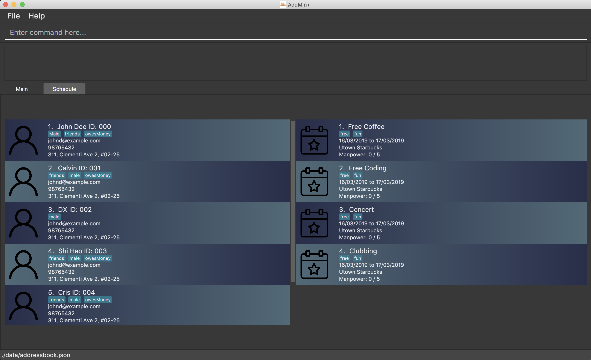
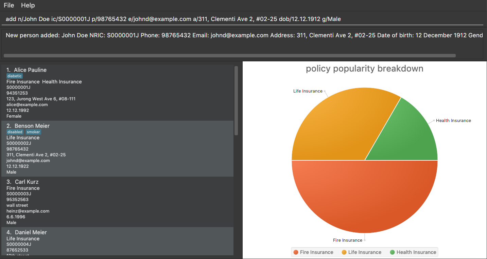

= FlashCard Pro
ifdef::env-github,env-browser[:relfileprefix: docs/]

image:https://travis-ci.org/AY1920S1-CS2103-F09-2/main.svg?branch=master["Build Status", link="https://travis-ci.org/AY1920S1-CS2103-F09-2/main"]
https://app.netlify.com/sites/flashcardpro/deploys[image:https://api.netlify.com/api/v1/badges/342bdfcd-063b-4527-b762-2139c38ba234/deploy-status[Netlify
Status]]
image:https://coveralls.io/repos/github/AY1920S1-CS2103-F09-2/addressbook-level3/badge.svg?branch=master[]

ifdef::env-github[]

endif::[]

ifndef::env-github[]

endif::[]

* FlashCard Pro is an application designed for *students who prefer to use a desktop app for managing flashcards*.
* It is also useful for teachers who would like to provide resources, in the form of custom flashcard decks, to support their students’ learning.
* FlashCard Pro is optimised for users who are *comfortable with Command Line Interface-based interaction*. It has a Graphical User Interface for viewing and interacting with the flashcards, but most of the user interactions are also accessible via the CLI.
* Users of FlashCard Pro may find using the CLI to be faster than the GUI as many interactions, such as tests, involve repetitive button clicks which can be suitably replaced by typing the respective commands.

== Who is FlashCard Pro for?
* Have you wished to create *more kinds of flashcards* in order to learn different things?
* Unlike traditional pen-and-paper flashcards or even existing flashcard apps like Anki, FlashCard Pro supports flashcards with *multiple choices*, and even flashcards that require you to *complete code snippets*!
* With FlashCard Pro, you can *test yourself* on each deck, *edit decks and cards* on-the-fly, and *view statistics* on your activity.
* Make a mistake and deleted a card or deck by accident? Any changes can be reversed with the *undo* command!
* Never fear losing all your flashcards ever again -- in FlashCard Pro, all decks are *stored in the lightweight and portable JSON format*, allowing decks to be migrated between devices, or sent to your friends! Teachers can also easily design their own decks for students to use as learning tools!

== Site Map

* <<UserGuide#, User Guide>>
* <<DeveloperGuide#, Developer Guide>>
* <<AboutUs#, About Us>>
* <<ContactUs#, Contact Us>>

== Acknowledgements

* Some parts of this sample application were inspired by the excellent http://code.makery.ch/library/javafx-8-tutorial/[Java FX tutorial] by
_Marco Jakob_.
* Libraries used: https://openjfx.io/[JavaFX], https://github.com/FasterXML/jackson[Jackson], https://github.com/junit-team/junit5[JUnit5]
* FlashCard Pro created by SE-EDU initiative at https://se-education.org

== Licence : link:LICENSE[MIT]
