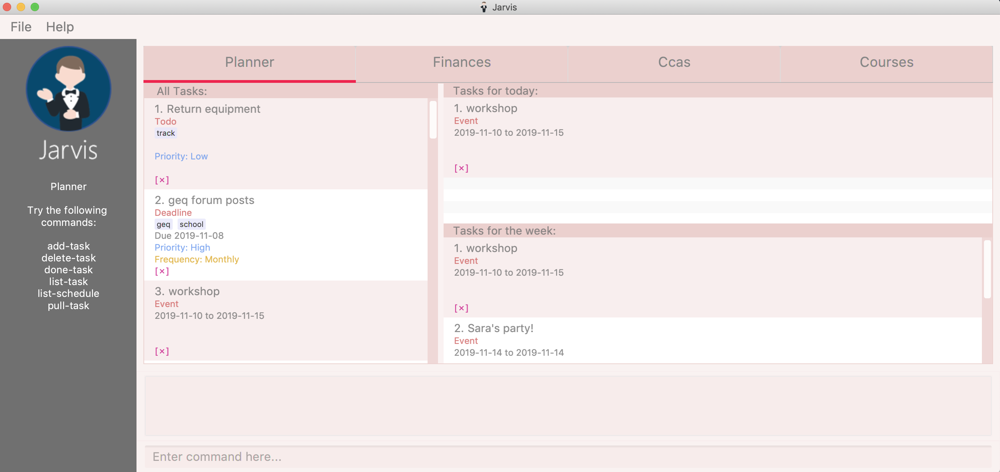

= JARVIS
ifdef::env-github,env-browser[:relfileprefix: docs/]

https://travis-ci.org/AY1920S1-CS2103T-T10-1/main[image:https://travis-ci.org/AY1920S1-CS2103T-T10-1/main.svg?branch=master[Build Status]]
https://ci.appveyor.com/project/marcfyk/main[image:https://ci.appveyor.com/api/projects/status/36rduw72xsyscn9o?svg=true[Build status]]
https://coveralls.io/github/AY1920S1-CS2103T-T10-1/main?branch=master[image:https://coveralls.io/repos/github/AY1920S1-CS2103T-T10-1/main/badge.svg?branch=master[Coverage Status]]
image:https://api.codacy.com/project/badge/Grade/78777849c5a44d42bef0726f03d6fc1a["Codacy code quality", link="https://www.codacy.com/manual/marcfyk/main?utm_source=github.com&utm_medium=referral&utm_content=AY1920S1-CS2103T-T10-1/main&utm_campaign=Badge_Grade"]
https://gitter.im/AY1920S1-CS2103T-T10-1-JARVIS/Lobby[image:https://badges.gitter.im/AY1920S1-CS2103T-T10-1-JARVIS/Lobby.svg[Gitter Chat]]

ifdef::env-github[]

endif::[]

ifndef::env-github[]

endif::[]

== What is JARVIS
JARVIS is a productivity manager tool designed for NUS students who want to consolidate
their schedule, tasks, finances and modules in one place.

Download JARVIS now to *_abstract_* your problems away.

== Site Map

* <<UserGuide#, User Guide>>
* <<DeveloperGuide#, Developer Guide>>
* <<AboutUs#, About Us>>
* <<ContactUs#, Contact Us>>

== Acknowledgements

* Original source code is from https://se-education.org/[AddressBook Level 3] by the _SE-EDU initiative_.
* Some parts of this sample application were inspired by the excellent http://code.makery.ch/library/javafx-8-tutorial/[Java FX tutorial] by
_Marco Jakob_.
* Libraries used: https://openjfx.io/[JavaFX], https://github.com/FasterXML/jackson[Jackson], https://github.com/junit-team/junit5[JUnit5]

== Licence : link:LICENSE[MIT]
