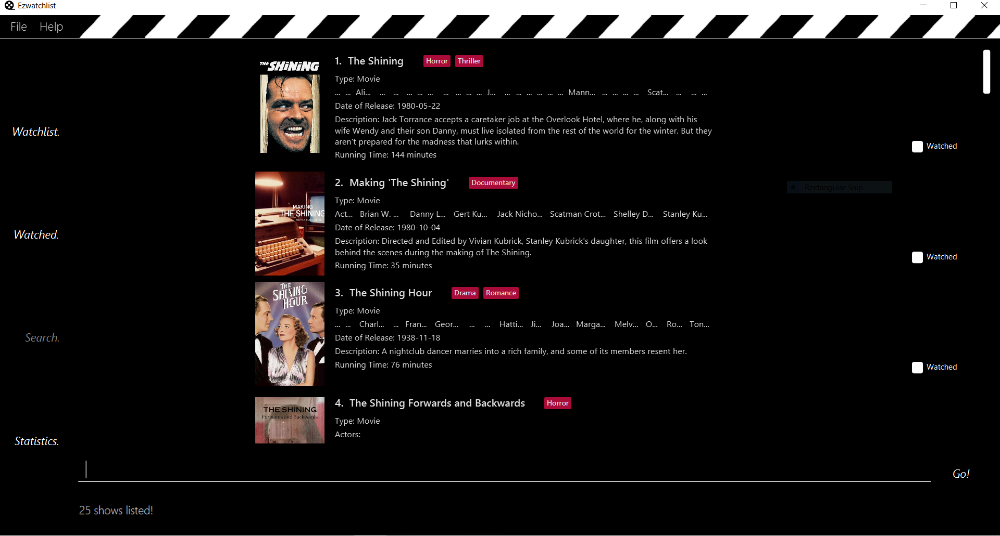

= ORGANice
ifdef::env-github,env-browser[:relfileprefix: docs/]

== Introduction

ORGANice is an organ transplant manager. +
This desktop application aims to facilitate the matching of organ transplants between patients and organ donors in hospitals. +
It is written in Java language in an Object-oriented fashion.

== Motivation

It is undeniable that organ transplantation is one of the most life-changing medical breakthroughs in history. +
For a transplant to be successful, we need to have an organ that matches the receiver. +
Since time is precious during transplant, we aim to provide an organ matching system to efficiently match organs from donors to the patients who need them.

== Target Users

This application is intended for hospital administrative staffs such as doctors and nurses.

== Installation

You can download the https://github.com/AY1920S1-CS2103T-T13-1/main/releases/[jar] file and run it from your desktop.

== Usage

You can refer to the <<UserGuide#, User Guide>> for a more detailed explanation.

== Technology and Framework Used

    Java SE Development Kit 11.0.4
    Travis
    Gradle
    Coveralls

== Screenshot of User Interface

ifdef::env-github[]

endif::[]

ifndef::env-github[]
image::images/Ui.png[width="600"]
endif::[]

== Build Status

https://travis-ci.org/AY1920S1-CS2103T-T13-1/main[image:https://travis-ci.org/AY1920S1-CS2103T-T13-1/main.svg?branch=master[Build Status]]

== Coverage

https://coveralls.io/github/AY1920S1-CS2103T-T13-1/main?branch=master[image:https://coveralls.io/repos/github/AY1920S1-CS2103T-T13-1/main/badge.svg?branch=master[Coverage Status]]

== Site Map

* <<UserGuide#, User Guide>>
* <<DeveloperGuide#, Developer Guide>>
* <<AboutUs#, About Us>>
* <<ContactUs#, Contact Us>>

== Acknowledgements

* Some parts of ORGANice were inspired by the excellent http://code.makery.ch/library/javafx-8-tutorial/[Java FX tutorial] by
_Marco Jakob_.
* Libraries used: https://openjfx.io/[JavaFX], https://github.com/FasterXML/jackson[Jackson], https://github.com/junit-team/junit5[JUnit5]
* ORGANice is adapted from AddressBook-Level3 project created by SE-EDU initiative at https://se-education.org

== Licence : link:LICENSE[MIT]
