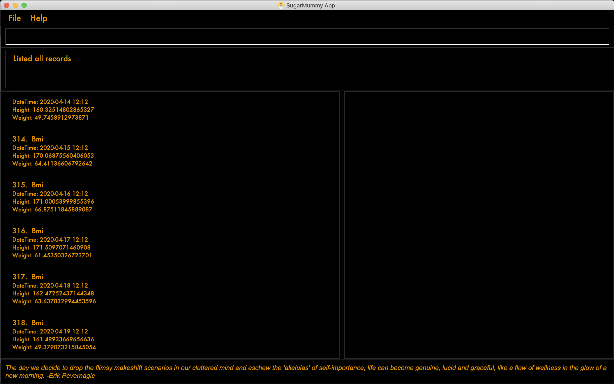
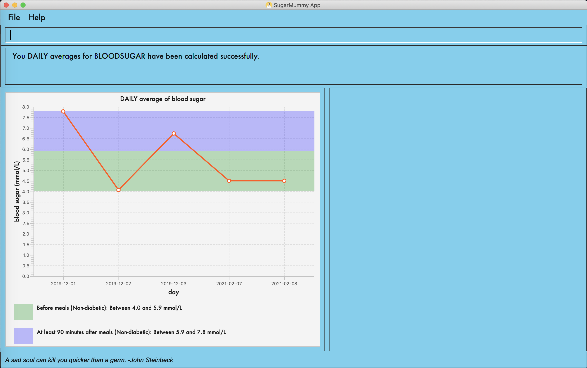
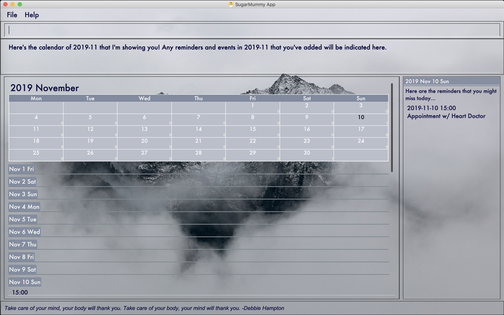
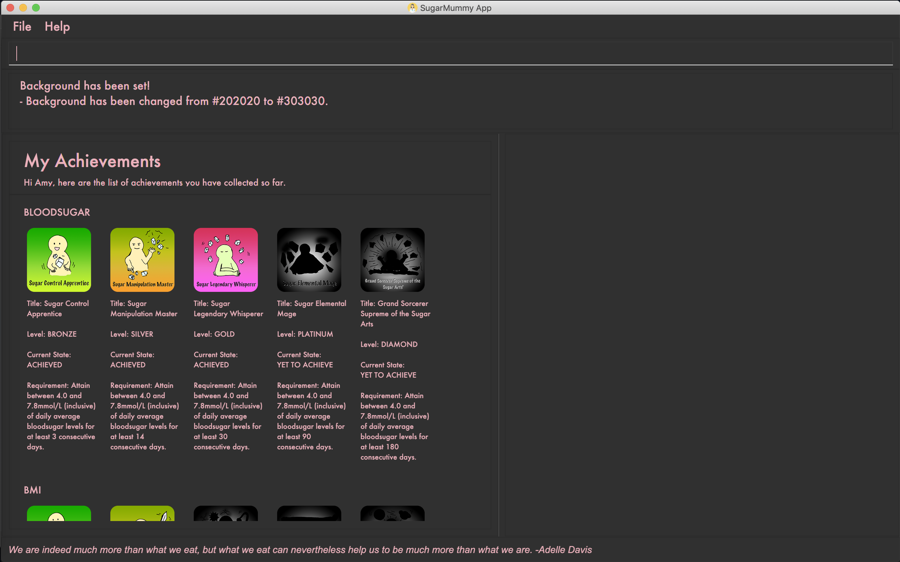

= SugarMummy
ifdef::env-github,env-browser[:relfileprefix: docs/]

https://travis-ci.com/AY1920S1-CS2103-T16-1/main[image:https://travis-ci.com/AY1920S1-CS2103-T16-1/main.svg?branch=master[Build Status]]

image::docs/images/Ui.png[width="600"]

image::docs/images/Ui_Bio.png[width="600"]

SugarMummy aims to help type II diabetes patients to live more healthily, conveniently, and happily.
It is a free software with useful functions:

* Data tracker for various data types (blood sugar levels and bmi)
* Easy-to-use reminder and calendar
* Personalized user experience (achievements, biography, and motivational quotes)
* Daily, Weekly and Monthly graph summary for your activities and health level
* Customized recommendations for healthy dieting

== Getting Started

=== prerequisites

Please ensure you have Java 11 or above installed in your Computer

=== Installing

Download the latest `sugarmummy.jar` link:https://github.com/AY1920S1-CS2103-T16-1/main/releases[here].

. Copy the file to the folder you want to use as the home folder for data records.
. Double-click the file to start the app.

== Site Map

* <<UserGuide#, User Guide>>
* <<DeveloperGuide#, Developer Guide>>
* <<AboutUs#, About Us>>
* <<ContactUs#, Contact Us>>

== Acknowledgements

* This project is adapted from AddressBook-Level3 project created by SE-EDU initiative at https://se-education.org
* Some parts of this sample application were inspired by the excellent http://code.makery.ch/library/javafx-8-tutorial/[Java FX tutorial] by
_Marco Jakob_.
* Libraries used: https://openjfx.io/[JavaFX], https://github.com/FasterXML/jackson[Jackson], https://github.com/junit-team/junit5[JUnit5]

== Licence : link:LICENSE[MIT]
