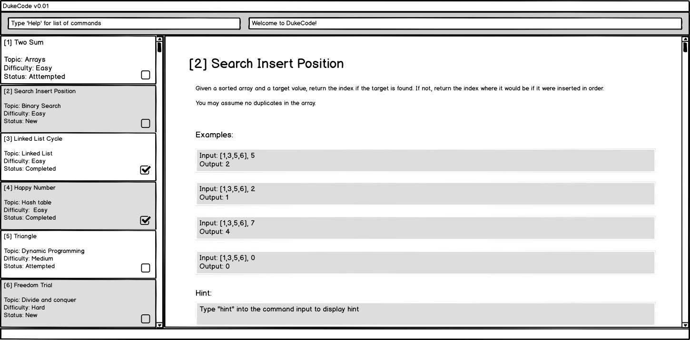
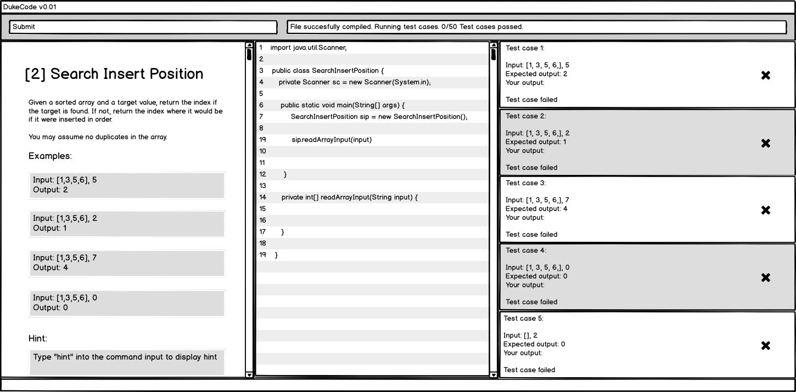

== Duke Academy
:site-section: ReadMe
:stylesDir: stylesheets
Data structure Practice App for your outstanding school results

https://travis-ci.org/AY1920S1-CS2103T-F14-1/main[image:https://travis-ci.org/AY1920S1-CS2103T-F14-1/main.svg?branch=master[Build Status]]
https://coveralls.io/github/AY1920S1-CS2103T-F14-1/main?branch=master[image:https://coveralls.io/repos/github/AY1920S1-CS2103T-F14-1/main/badge.svg?branch=master[Coverage Status]]
image:https://api.codacy.com/project/badge/Grade/967c7be5909941f486c674f65e6332e4["Codacy code quality", link="https://www.codacy.com/manual/dukecodedoc/main?utm_source=github.com&utm_medium=referral&utm_content=AY1920S1-CS2103T-F14-1/main&utm_campaign=Badge_Grade"]

ifdef::env-github[]
image::docs/images/Ui.png[width="600"]
endif::[]

ifndef::env-github[]
image::images/Ui.png[width="600"]
endif::[]

== What is Duke Academy?

[none]
* *Duke Academy* is a desktop application to auto-grade Data Structure & Algorithms problems.
* It is a Java application intended for students learning Data Structure & Algorithms to practice their coding skills.
* It has a GUI but most of the user interactions happen using a CLI (Command Line Interface).

== Preview

You can browse questions:

ifdef::env-github[]

endif::[]

ifndef::env-github[]
image::images/userguide/view.png[width="600", text-center]
endif::[]

'''

Attempt Questions and view results:

ifdef::env-github[]

endif::[]

ifndef::env-github[]
image::images/userguide/submit.png[width="600", text-center]
endif::[]

== Install
[none]
* Make sure your java version is at least `11`.
* Download the jar file from the https://github.com/AY1920S1-CS2103T-F14-1/main/releases[latest release].

== Quick Start
* Open terminal and type `java -jar dukeacademy.jar` to start the app.
* Type `list` in the command box. Open a question by `view <question ID>`, e.g. `view 2103`. Attempt the question by `attempt <question ID>`, e.g. `attempt 2103`.
* Start your first Duke Academy code!
* For any help, type `help`.

== See Also

* For students and educators, please refer to the <<UserGuide#, user guide>>.
* This is an open source project. To contribute, please refer to the <<DeveloperGuide#, developer guide>> to get familiar with the code base.
* <<AboutUs#, About Us>>
* <<ContactUs#, Contact Us>>

== Acknowledgements

* Some parts of this sample application were inspired by the excellent http://code.makery.ch/library/javafx-8-tutorial/[Java FX tutorial] by
_Marco Jakob_.
* The original source code comes from the https://se-education.org[AddressBook-Level 3 project] created by SE-EDU initiative.
* Libraries used: https://openjfx.io/[JavaFX], https://github.com/FasterXML/jackson[Jackson], https://github.com/junit-team/junit5[JUnit5]

== Licence : link:LICENSE[MIT]
