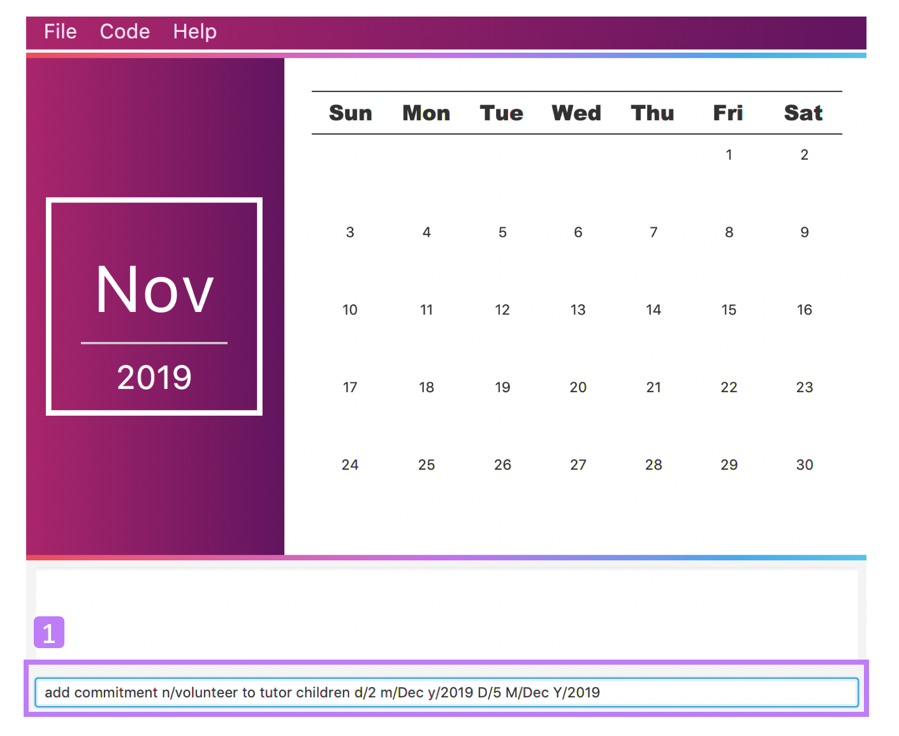
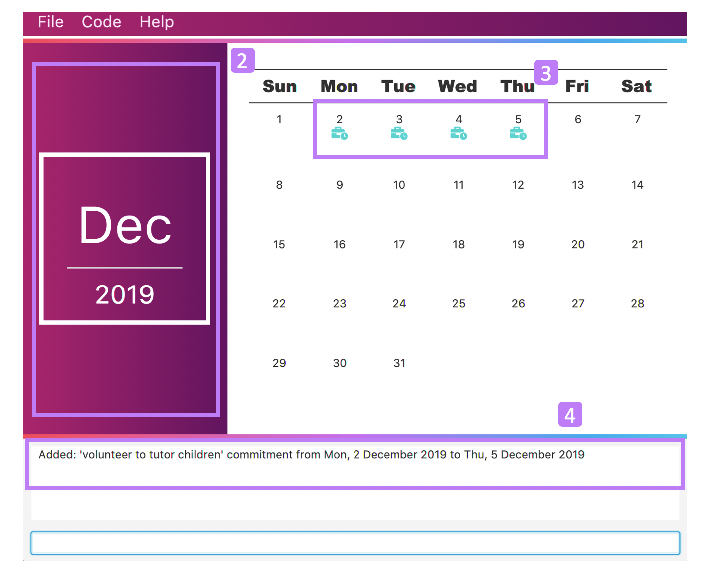

= TravEzy
:site-section: UserGuide
:toc:
:toc-title:
:toc-placement: preamble
:sectnums:
:imagesDir: images
:stylesDir: stylesheets
:xrefstyle: full
:experimental:
ifdef::env-github[]
:tip-caption: :bulb:
:warning-caption: ⚠️ 
:note-caption: :information_source:
endif::[]
:repoURL: https://ay1920s1-cs2103t-t17-2.github.io/main/

By: `Team SE-EDU`      Since: `Aug 2019`      Licence: `MIT`

Team: *T17-2*

*Content*

== Introduction
//tag::intro
image::TraveEzyLogo.png[TravEzy Logo]

Welcome to *TravEzy*! 😊

Firstly, thank you for downloading our application. We greatly appreciate your support and
we *promise* to make travel easy, with TravEzy.

So, is TravEzy for you?

. Are you a busy university student with a passion for travelling?
. Are your summers and winters filled with internships, projects and CCA activities?
. Do your numerous commitments get in the way of your travel plans?

IF you answered yes to the questions above, then __yes__ it is. If not, it still is :)

What is TravEzy? TravEzy is a desktop application with a command line interface (CLI) and is *perfect* for NUS students who love travelling as much as we do. What's more, with a (CLI), you will be able to type in your commands much faster than similar applications which require you to keep using your mouse

TravEzy is perfect for:

. Managing your busy calendar and finding the optimal period (_after your finals_) to take that much needed holiday!

. Creating the ideal itinerary for your 3 day shopping trip to Bangkok :)

. Tracking your expenses during your trip, so that you have enough money left for the trip home

. Journaling in your travel diary and effortlessly looking at old entries to recall your exchange trip to Sweden.

. Calling old and new friends using the address book in TravEzy

What are you waiting for? Hop on to this user guide and we will
travel to +++<u>+++Section 2, “Quick Start”+++</u>+++ to start TravEzy 😊

== Quickstart

. Grab a cup of coffee

. Ensure that you have Java 11 or above installed in your Computer.

. Download the latest
https://github.com/AY1920S1-CS2103T-T17-2/main/releases[TravEzy.jar]

. Copy the file to the folder you want to use as the home folder for TravEzy.

. Double-click the file to start the app.
The GUI (Graphical User Interface) should appear in a few seconds.

. You are now in the Main Page of TravEzy.

. At the bottom of the screen, type the command in the command box and press *<Enter>* on your keyboard to execute it.
E.g. typing *help* and pressing *<Enter>* will open the help window.

. Examples commands you may try:
.. *goto diary* : Open up the diary portion of TravEzy
.. *list* : Shows all the entries in your diary
.. *delete 3* : deletes the 3rd entry in the diary book
.. *exit*: exits the app

Refer to Section 3, “Features” for details of each command.

== Preface

Excited to start using _TravEzy_? Read this section to find out how this document is structured, and what each symbol and special font style mean. We promise that this will help you to get started with using _TravEzy_ more quickly! 😊

=== Structure of this Document

Nobody likes to read long documents, especially when you have something as exciting as TravEzy to use. So, we have organised this document such that you can easily look for what *you* need. 

We've split up this guide into the different features of our application, namely:

. Main
. Calendar
. Itinerary
. Address Book
. Diary
. Achievements

In each of the above sections, you will be introduced to the *interface* of the feature, the *_parameters_* (which are just like those fields you fill up in a regular form📝) and the *commands* that will do the menial tasks for you.

=== Reading this Document

Symbols and fanciful (okay, different) fonts are exciting, aren't they? Let's find out more about what they mean in this document!

.Symbols and fonts (rows)
[grid="rows", frame="none"]
|===
| Symbol/font | What does it mean?

| _italics_
| An italicised text indicates that the text has a definition that is (rather) specific to the application. Do look out for the definitions of these words along the way. If not, please look at the glossary in section 13).
 
| ``command``
| A grey highlight means that you can type the words into _TravEzy_ and it will start performing tasks for you

| ``MONTH``
| Uppercase letters that are highlighted in grey indicate that the word is a _parameter_.footnote:[Remember what this means? A parameter is merely like a field in your regular form. Just replace it and fill it up with anything appropriate. 😊]

| ``m\MONTH``
| The slash and letter (or word) before the _parameter_ is a _prefix_. It is used to separate the current _parameter_ from other _parameters_.

| ``[m\MONTH]``
| Square brackets imply that the the stated _prefix_ and _parameter_ are optional. (This means less typing! 😆)

| 💡  
| A light bulb indicates that what is to follow is a tip. 

| ⚠️  
| A warning sign indicates that what is to follow is important.
 
|===

== Main
Hi!

Main is the welcome screen for TravEzy. From here, you can navigate to the other pages, such as calendar,
financial tracker, achievements etc. You can also the exit the application from here.

Don't worry! You can also navigate to other pages
and exit when you are already inside in a page such as itinerary.

=== Go To Command

Trying to open up the achievements page? Use the *Go To Command*:

*Go To another page: ``goto``*

Allows you to navigate to different pages (from any page), with the possible pages being:

. main
. calendar
. itinerary
. address_book
. financial_tracker
. diary
. achievements

The _Command Word_ is `goto` and the parameter can be any of the pages listed above. There is no
need for a _Prefix_.

Format: ``goto page``

Example: Let's say I want to go back to the main page to see the beautiful TravEzy logo -

``goto main``

=== Exit Command

It's time to catch your flight! Better exit TravEzy using the *Exit Command* and
start your trip!

*Exit TravEzy: ``exit``*

Allows you to exit from TravEzy

The _Command Word_ is `exit` and there are no additonal parameters.

Format: ``exit``

Example: Let's say I have to exit the calendar page -

``exit``

== Calendar

It's the end of the semester but there are still orientation camps, internships, and family commitments to attend to. However, the desire to unwind by travelling after a long and tiring semester is just *too strong*. Sounds like you?

Well, _TravEzy_ has got you covered. Simply inform _TravEzy_ of your schedule (your _commitments_, _school breaks_, public _holidays_ and _trips_) and _TravEzy_ will suggest periods of time when you can travel! Excited to find out more? Well... Read on!

=== Interface

EMPHASISE THAT THE LABEL IS ONLY FOR EVENT TYPE

=== Adding an event to your calendar: ``add``

Whew! After reading so much, it is time to find out how you can add your _event_ so that _TravEzy_ can start suggesting when you can travel! 😊

*Format:* +
``add EVENT TYPE n/NAME d/START DAY [m/START MONTH] [y/START YEAR] [D/END DAY] [M/END MONTH] [Y/END YEAR]``

*Examples:*
****
* To add a _commitment_,

    add commitment n/volunteer to tutor children d/2 m/Dec y/2019 D/5 M/Dec Y/2019

* To add a _holiday_,

    add holiday n/labour day d/1 m/May y/2020

* To add a _school break_,

    add school_break n/winter vacation d/8 m/Dec y/2019 D/12 M/Jan Y/2020

* To add a _trip_,

    add trip n/Bali 3D2N d/10 m/Dec y/2019 D/13 M/Dec Y/2019

****

*Step by step:*

Step 1. Type ``add commitment n/volunteer to tutor children d/2 m/Dec y/2019 D/5 M/Dec Y/2019`` in the _command box_ and click _Enter_. +

Step 2. The _month and year panel_ will change to "December" and the relevant view will be shown.

Step 3. In the _month view panel_, you will be able to see the newly added _labels_.

Step 4. The _result box_ will also display a message to indicate that your _commitment_ has been successfully added. +

TIP: You do not have to specify the ``END YEAR``, ``END MONTH`` and/or ``END DAY`` if they are the same as ``START YEAR``, ``START MONTH`` and/or ``START DAY``, respectively.

WARNING: If you leave out the month and/or year, the current month and/or year will be used. This applies to the following commands as well.

=== Deleting an event from your calendar: ``delete``

Yes, we have all had that experience. We thought that next Friday is a public _holiday_ even though it isn't. However, you have added this _holiday_ to _TravEzy_! 😧 What should you do now? Delete it!

But how? Well, this is the section for you. 😀

*Format:* +
``delete EVENT TYPE n/NAME d/START DAY [m/START MONTH] [y/START YEAR] [D/END DAY] [M/END MONTH] [Y/END YEAR]``

*Examples:*
****
* To delete a _commitment_,

    delete commitment n/volunteer to tutor children d/2 m/Dec y/2019 D/5 M/Dec Y/2019

* To delete a _holiday_,

    delete holiday n/labour day d/1 m/May y/2020

* To delete a _school break_,

    delete school_break n/winter vacation d/8 m/Dec y/2019 D/12 M/Jan Y/2020

* To delete a _trip_,

    delete trip n/Bali 3D2N d/10 m/Dec y/2019 D/13 M/Dec Y/2019

****

*Step by step:*
(You have accidentally indicated that 13 August 2019 is an observed holiday for national day and you would like to delete it from TravEzy. MORE COMING SOON...)

=== Showing your schedule for the month: ``show``

After adding and deleting your events, you can have an overview of them!

How easy is it?

*Format:* +
``show m/MONTH [y/YEAR]``

*Example:* +

    show m/Dec

WARNING: Do remember that if you leave out the year (as we have done in this example), the current year will be used. This applies to the following commands as well.

*Step by step:*
(COMING SOON)

=== Listing your events: ``list``

If you would like to view your events as a list instead, this command would be helpful!

*Format:* +
``list [d/START DAY] [m/START MONTH] [y/START YEAR] [D/END DAY] [M/END MONTH] [Y/END YEAR]``

*Examples:*
****
* To list all events,

    list

* To list all events that happen between 2 December 2019 to 10 December 2019,

    list d/2 m/Dec y/2019 D/10 M/Dec Y/2019

****

=== Checking your availability for a trip: ``check``

Do you need to find out whether you are available to go for a trip? You can get _TravEzy_ to find that out for you (i.e. when you happen to have a school break/holiday then *and* do not have any commitment/trip then).

Let's find out how!

*Format:* +
``check d/START DAY [m/START MONTH] [y/START YEAR] [D/END DAY] [M/END MONTH] [Y/END YEAR]``

*Examples:*
****
* To check whether you are available on 9 December 2019,

    check d/9 m/12 y/2019

* To check whether you are available from 9 to 20 December 2019,

    check d/9 m/Dec y/2019 D/20 M/Dec Y/2019

****

*Step by step:*
(COMING SOON)

=== Suggesting a suitable time for a trip: ``suggest``

The end of the semester is near. It is time to look for some cheap flights🛫! However, before deciding which flight to book, you need to find out whether it suits your schedule. No worries! _TravEzy_ has got you covered. 😊

How so? Just ask _TravEzy_ to suggest a suitable time!

*Format:* +
``suggest d/START DAY [m/START MONTH] [y/START YEAR] [D/END DAY] [M/END MONTH] [Y/END YEAR] [p/PERIOD]``

*Examples:*
****
* To find out when you can travel between 9 and 20 December 2019,

    suggest d/9 m/Dec y/2019 D/20 M/Dec Y/2019

* To find out when you can travel for at least 5 days between 9 and 20 December 2019,

    suggest d/9 m/Dec y/2019 D/20 M/Dec Y/2019 p/5

****

== Itinerary

It's always good to plan ahead for each day of your trip. Start planning your schedule with TravEzy Itinerary planner today and be amazed by
the increase in your day's productivity!

Each entry in your Itinerary has 6 key sections:

. Title
. Date
. Time
. Location
. Description
. Tag

The title is the name of the event. This is followed by the date and time for the execution of that event.
Lastly, the location and description are additional details of the event. Example of your events could include
hiking Mt. Everest, visiting Tokyo Disneyland, or even doing CS2103T user guide! Be amazed with how much you can actually
do within the 24 hours you are given everyday. Let's stop skiving and dive right into productivity.

=== Interface

Upon navigating to the itinerary page, this is how the itinerary page looks like:

.Itinerary Interface
image::/images/ItineraryInterface.png[]

=== Parameter

Let's start off with understanding how each parameter work first!

When inputting an event into the Itinerary, every fields are *compulsory*. However, the *location* and
*description* fields need not be specified. If you did not indicate the *location* and *description* field, the default
value "-" will be used instead.

Below are the _PREFIX_ convention that TravEzy's Itinerary will be using.

. Title: The _PREFIX_ is ``title/``. This is the crux of every event as it provides a name to the event that you
intend to do. For example:

    title/Do CS2103T developer guide

. Date: The _PREFIX_ is ``date/``. TravEzy itinerary allows dates that starts from the year 1000 up till the year 3999.

Note that the format TravEzy's Itinerary using is "ddMMyyyy". For example:

    date/30102019

. Time: The _PREFIX_ is ``time/``. Note that the format TravEzy's Itinerary is using is 24-Hour format. However,
TravEzy Itinerary will reformat the time into 12 hour format when shown on the card. For example:

    time/0000

. Location: The _PREFIX_ is ``l/``. This is the place where your event is happening at it could be a country or just
a venue. For example:

    location/Singapore      or      location/Outer Space

. Description: The _PREFIX_ is ``d/``. You can type in just a word, phrase or sentence.

    d/pen       or      d/pen pineapple apple pen

. Tag: You can select from the dropdown menu to select the importance of each event is through the various priority tagging
available. The default priority tagging is set to *Priority: None*. There is no prefix for the tagging field and you're
not allowed to edit it :(

=== Viewing help: ``help``

Unsure on how to navigate your way through the TravEzy Itinerary feature? Don't worry we got your back!

Just call for ``help`` and the help window will come to the rescue!

The _Command Word_ is help without further parameters.

[TIP]
You can click on the *copy* button beside each feature to copy onto your own clipboard the syntax for calling each feature
in the TravEzy Itinerary page.

Example:

``help``

=== Adding an event: ``add``

Plan to go Disneyland tomorrow? Add some rides that you plan to take then!

*Add an entry to your Itinerary:* ``add``

Adds an event to your itinerary, with the parameters: title, date, time, location, description.

The _Command Word_ is ``add`` and the prefixes are ``title/`` for title, ``date/`` for date, ``time/`` for time,
``l/`` for location and ``d/`` for description. Location ``l/`` and Description ``d/`` are optional.

Format: ``add title/TITLE date/DATE time/TIME [l/LOCATION] [d/DESCRIPTION]``

Example:

``add title/awesome title date/30102019 time/2359 l/Singapore d/I love TravEzy!``

=== Deleting a person: ``delete``

Added a wrong event? Don't worry you can always remove it from the list. Awesome Possum!

*Delete an event*: ``delete``

Deletes an event from your Itinerary with the only parameter being the index of the event you want to delete.
The index must be an integer which is greater than 1 and corresponds to ID of the event you want to delete.

The _Command Word_ is ``delete`` with an parameter index.
Format: ``delete INDEX``

Example: Delete the first event you saw on your event list.

``delete 1``

=== Editing a person: ``edit``

Had a change in plans? Let's us edit our previous event then!

*Edit an event:* ``edit``

Edit an event in your Itinerary with the only parameter being the index of the event you want to edit.
The index must be an integer which is greater than 1 and corresponds to ID of the event you want to edit.

The _Command Word_ is ``edit`` with an parameter index.

Format: ``edit index``

Example: Edit the 3rd event you plan to do in your event list.

``edit 3``

=== Checking a command as done: ``done``

Impressive! You have completed the event you have planned for the day. Let us check it for you!

*Mark as done an event:* ``done``

Mark as done an event in your Itinerary with the only parameter being the index of the event you want to check.
The index must be an integer which is greater than 1 and corresponds to ID of the event you want to check.

The _Command Word_ is ``done`` with an parameter index.

Format: ``done index``

Example: Check the 100th event that you have accomplished today.

``done 100``

=== Listing all events: ``list``

Awesome! You have planned your schedule, now we give you a way to list out all your events that you have planned out
in a single list.

*List all events in the Itinerary:* ``list``

List out all the events that are currently in the event list. Good for organizing your schedule and have a broad overview
of all the events that you have planned for yourself. Congratulations, you are one step closer to having a more productive day.
Give yourself a pat on the back! :)

The _Command Word_ is ``list``.

Format: ``list``

Example: Listing all the events that you planned

``list``

=== Clearing all entries: ``clear``

Want a quick an easy way to wipe off all your events from the face of this Earth? Use the clear command to do so!

*Clear all events in the Itinerary:* ``clear``

Removes all the event in the list so as to reduce the hassle for users to continuously call the delete command multiple
times in order to remove all events in the list.

[WARNING]
The clear function removes *ALL* the events that you have planned in your event itinerary. This action *CANNOT* be
undone. Hence, only click on the *Proceed* button if you are sure that you want to clear the list.

The _Command Word_ is ``clear``.

Format: ``clear``

Example: Clear all the events that you have planned in the event list.

``clear``

===  Greet TravEzy itinerary: ``greet``

🌚🌚🌚 Greetings fellow traveller! 🌚🌚🌚

*Greet the user with the current time and show the events they have for that day:* ``greet``

TravEzy Itinerary will greet the user by providing them with the current time and the date today. We will also filter
your event list to show only the events that you have for thee day.

The _Command Word_ is ``greet``.

Format: ``greet``

Example: Greeting TravEzy for your daily event list

``greet``

=== Showing past commands: ``history``

Curious on what inputs you have entered to the Itinerary page? We also help you keep track of that too in the Itinerary
page!

*History of the previous command will be shown:* ``history``

TravEzy Itinerary will keep track of the previous inputs that you have called in the Itinerary page.

The _Command Word_ is ``history``

Format: ``history``

[TIP]
You can press the *↑* up and *↓* down arrow keys to toggle between the previous commands that you have called in the
Itinerary page during that session.

Example: Let's say you are curious on what are the previous commands that you have called.

``history``

=== Searching for an event: ``search``

Is your event list too cluttered up with events? Use the search command to zoom in to specific events that you are
looking for.

[TIP]
If your event list is too cluttered up, try using the ``clear`` command instead to reset the whole event list

*Search and filter out events that meets the search condition:* ``search``

The search feature is especially useful when you want to filter out and zoom into specific events that you have in mind
and want to check those out.

The _Command Word_ is ``search``

Format: ``search title/TITLE | date/DATE | time/TIME | l/LOCATION | tag/(Use the dropdown menu)``

Example: If you want to search for events that are dated 10/10/2010 (Wedding theme song :D)

``search date/10102010``

=== Sorting the events: ``sort``

TravEzy Itinerary will help you sort out your life!

*Sorts all the event in the event list based on the condition given:* ``sort``

The sort feature is useful when you want to sort all your events out to a particular condition such as in chronological
order or in order of importance of the event.

The _Command Word_ is ``sort``

Format: ``sort by/TITLE | LOCATION | CHRONOLOGICAL | COMPLETION | PRIORITY``

Example: After a hard day's work, you wish to view all your completed tasks grouped together and admire your fruits
of labour.

``sort by/completion``

=== Undoing the previous command
*-> Coming up in v2.0*

=== Redoing the previous undo
*-> Coming up in v2.0*

=== Wishing for the perfect event
*-> Coming up in v2.0*

== Address Book

Helps you to keep track of your friends’ contact information from different countries.

=== Viewing help : `help`

Format: `help`

=== Adding a person: `add`

Adds a person to the address book +
Format: `add n/NAME p/PHONE_NUMBER e/EMAIL a/ADDRESS [t/TAG] [r/REMARK][c/COUNTRY]`

[TIP]
A person can have any number of tags (including 0)

Examples:

* `add n/John Doe p/98765432 e/johnd@example.com a/John street, block 123, #01-01`
* `add n/Betsy Crowe t/friend e/betsycrowe@example.com a/Newgate Prison p/1234567 t/criminal r/Best friend c/Singapore`

=== Listing all persons : `list`

Shows a list of all persons in the address book. +
Format: `list`

=== Editing a person : `edit`

Edits an existing person in the address book. +
Format: `edit INDEX [n/NAME] [p/PHONE] [e/EMAIL] [a/ADDRESS] [t/TAG] [r/REMARK] [c/COUNTRY]`

****
* Edits the person at the specified `INDEX`. The index refers to the index number shown in the displayed person list. The index *must be a positive integer* 1, 2, 3, ...
* At least one of the optional fields must be provided.
* Existing values will be updated to the input values.
* When editing tags, the existing tags of the person will be removed i.e adding of tags is not cumulative.
* You can remove all the person's tags by typing `t/` without specifying any tags after it.
* You can remove the person's remark by typing `r/` without specifying any remark after it.
* You can remove the person's country by typing `c/` without specifying any country after it.

****

Examples:

* `edit 1 p/91234567 e/johndoe@example.com` +
Edits the phone number and email address of the 1st person to be `91234567` and `johndoe@example.com` respectively.
* `edit 2 n/Betsy Crower t/` +
Edits the name of the 2nd person to be `Betsy Crower` and clears all existing tags.
* `edit 3 n/Alexander Bell c/` +
Clear the country of the 3rd person to be `Alexander Bell`.

=== Locating persons by name: `find`

Finds persons whose names contain any of the given keywords. +
Format: `find KEYWORD [MORE_KEYWORDS]`

****
* The search is case insensitive. e.g `hans` will match `Hans`
* The order of the keywords does not matter. e.g. `Hans Bo` will match `Bo Hans`
* Only the name is searched.
* Only full words will be matched e.g. `Han` will not match `Hans`
* Persons matching at least one keyword will be returned (i.e. `OR` search). e.g. `Hans Bo` will return `Hans Gruber`, `Bo Yang`
****

Examples:

* `find John` +
Returns `john` and `John Doe`
* `find Betsy Tim John` +
Returns any person having names `Betsy`, `Tim`, or `John`

// tag::delete[]
=== Deleting a person : `delete`

Deletes the specified person from the address book. +
Format: `delete INDEX`

****
* Deletes the person at the specified `INDEX`.
* The index refers to the index number shown in the displayed person list.
* The index *must be a positive integer* 1, 2, 3, ...
****

Examples:

* `list` +
`delete 2` +
Deletes the 2nd person in the address book.
* `find Betsy` +
`delete 1` +
Deletes the 1st person in the results of the `find` command.

// end::delete[]
=== Clearing all entries : `clear`

Clears all entries from the address book. +
Format: `clear`

=== Exiting the program : `exit`

Exits the program. +
Format: `exit`

=== Saving the data

Address book data are saved in the hard disk automatically after any command that changes the data. +
There is no need to save manually.

== Financial Tracker
Scare that you're gonna overspend whenever you're on a trip? Afraid no more! TravEzy's Financial Tracker allow you to track your
expenses seamlessly!

Each entry in your expense has 6 key sections:

. Date
. Time
. Amount
. Description
. Type of expenditure
. Country

The Date and Time specify when you spend your expenses, followed by the amount, description, types of expenditure and country where you're current travelling at. Example of the types of expenditure are food, entertainment, healthcare, etc. You name it, TravEzy tracks it! In Financial Tracker, you will be able to manage your expenses easily.

=== Interface
This is what you will see when navigated to the financial tracker:

.Financial Tracker Interface
image::/images/FinancialTrackerInterface.png[]

=== Parameters
Let's understand how to use your parameters first!

In an expense, every fields are *compulsory*. However, the *date* and *time* fields need not be specified, it'll be recorded down automatically based on the date and time you recorded the expense. Convenient enough, right?

Below are the _PREFIX_ convention that TravEzy's Financial Tracker will be using.

. Date. The _PREFIX_ is ``date/``. Note that the format TravEzy's Financial Tracker using is "ddMMyyyy". For example:

    date/30102019

. Time. The _PREFIX_ is ``time/``. Note that the format TravEzy's Financial Tracker using is 24-Hour format. For example:

    time/1359

. Amount. The _PREFIX_ is ``a/``. Let's say you've spent 3.50 dollars. You would enter:

    a/3.5

. Description. The _PREFIX_ is ``d/``. You can type in a sentence or a phrase.

    d/Breakfast     or     d/Mala at the Deck

. Type of expenditure. The _PREFIX_ is ``t/``. Specify which type of expenditure you are spending.

    t/food

. Country. You can switch between countries by using the ``switch`` command or select from the dropdown menu to select which countries you're currently in. The default country every time you launch the application is *Singapore*. There is no prefix for country field and you're not allowed to edit it :(

 Look out for switch command below!

=== Adding an expense: ``add``
Adding what you've spent at the nice coffee shop you stopped by?

The _Command Word_ is ``add`` and the prefixes are ``a/`` for amount, ``d/``
for description, ``t/`` for type of expenditure. Date ``date/`` and time ``time/`` are optional. +
This command adds an expense to your Financial Tracker, with the parameters: amount, description, type, date and time.

Format: ``add a/AMOUNT d/DESCRIPTION t/TYPE_OF_EXPENDITURE [date/DATE] [time/TIME]``

Example:

 add a/4 t/dinner at Vivocity t/food

Illustration:

. type ``add a/2.89 d/Meiji Milk t/grocery`` in the command box and press _Enter_.

image::/images/FinancialTrackerAdd1.png[]

[start = 2]
. The result box will display the message "Expense added".

image::/images/FinancialTrackerAdd2.png[]

[start = 3]
. Now you can find your added expense in the expense list.

image::/images/FinancialTrackerAdd3.png[]

=== Deleting an expense: ``delete``
Added a wrong expense? Of course you can delete it if you want to :)

The _Command Word_ is ``delete`` with an parameter index. +
This command deletes an expense from your Financial Tracker with the only parameter being the index of the expense you want to delete. The index must be an integer which is greater than 1 and corresponds to ID of the expense you want to delete.

Format: ``delete INDEX``

Example: Delete the first expense you saw on your expense list.

 delete 1

Illustration:

. type ``delete 3`` in the command box and press _Enter_.

image::/images/FinancialTrackerDelete1.png[]

[start = 2]
. The result box will display the message "Your expense has been deleted".

image::/images/FinancialTrackerDelete2.png[]

[start = 3]
. Now your expense has been deleted from the expense list.

image::/images/FinancialTrackerDelete3.png[]

=== Editing an expense: ``edit``
Add a wrong expense? Why not edit it instead!

The _Command Word_ is ``edit`` with an parameter index. +
This command edits an expense in your Financial Tracker by specifying the index of the expense you want to edit, followed by the fields you want to edit. The index must be an integer which is greater than 1 and corresponds to ID of the expense you want to edit.

Format: ``edit INDEX [a/AMOUNT] [d/DESCRIPTION] [t/TYPE_OF_EXPENDITURE] [date/DATE] [time/TIME]``

Example: Edit the 3rd expense you saw on your expense list.

 edit 3 a/29.80 d/Nike bottle

Illustration:

. Notice the current fields in the expense with id number 1. Now, type ``edit 3 a/22.90 time/2200`` in the command box and press _Enter_.

image::/images/FinancialTrackerEdit1.png[]

[start = 2]
. The result box will display the message "The expense updated successfully!".

image::/images/FinancialTrackerEdit2.png[]

[start = 3]
. Now the first expense's time and amount fields have been changed to `22.90` and `10:00 p.m.` respectively.

image::/images/FinancialTrackerEdit3.png[]

// tag::financialtracker[]
=== Switching between countries: ``switch``
Currently in somewhere else? Switch to that expense list instead!

The _Command Word_ is ``switch`` followed by a country field. This command switched your current view of expense list to the country specified. Note that the list of countries that are valid is only shown on the _countries drop down menu_. +
Do realise that you can always use the drop down menu instead!

Example:

 switch Japan

Illustration:

. Type ``switch Japan`` in the command box and press _Enter_.

image::/images/FinancialTrackerSwitch1.png[]

[start = 2]
. The result box will display the message "Expense list switched".

image::/images/FinancialTrackerSwitch2.png[]

[start = 3]
. Now your expense list has been switched to that which is in Japan!

image::/images/FinancialTrackerSwitch3.png[]

=== Requesting help: ``help``
At anytime, not sure what to do? Simply ask for help!

The _Command Word_ is ``help`` without further parameters. A help window will pop out to guide you how to use the commands in Financial Tracker.

Example:

 help

Illustration:

. Type ``help`` in the command box and press _Enter_.

image::/images/FinancialTrackerHelp1.png[]

[start = 2]
. The result box will display the message "Currently viewing the financial tracker help window".

image::/images/FinancialTrackerHelp2.png[]

[start = 3]
. As you should have noticed, the help window has been popped out for your reference!

image::/images/FinancialTrackerHelp3.png[]

=== Sort out your expense list: ``sort``
Sort your expenses according your needs!

The _Command Word_ is ``sort`` with parameters "date", "time", "amount", "type" or "default". +
"default": Sort by default, which is sorting by dates followed by time.

This command sort your current expense list according to the stated specification in decensing order.

Format: ``sort date`` | ``sort time`` | ``sort amount`` | ``sort type`` | ``sort default``

Example: to sort by amount

 sort amount

Illustration:

. Notice the amount field in each expenses are currently not in order. Now, type ``sort amount`` in the command box and press _Enter_.

image::/images/FinancialTrackerSort1.png[]

[start = 2]
. The result box will display the message "Expense List sorted!".

image::/images/FinancialTrackerSort2.png[]

[start = 3]
. Now all your expenses are sorted in descending order of your amount!

image::/images/FinancialTrackerSort3.png[]

=== Generate an overview of your spending: ``summary``
View your expenses all at once!

The _Command Word_ is ``summary`` without any parameter. +
This command generate statistics of your financial expenses in a Pie Chart form and also in a Bar Char form.
You can now view your total spending easily!

Example:

 summary

Illustration:

. Type `summary` in the command box and press _Enter_.

image::/images/FinancialTrackerSort1.png[]

[start = 2]
. The result box will display the message "Currently viewing the Summary Window".

image::/images/FinancialTrackerSummary2.png[]

[start = 3]
. As you should have noticed, the Summary Window has been popped out showing you statistics of your expenses in a nice-looking pie chart and bar chart form!

image::/images/FinancialTrackerSummary3.png[]

// end::financialtracker[]

== Diary

The sweetest part of any holiday is looking back at your fond memories. TravEzy's
Diary allows you to do just that!

Each entry in your diary has 4 key sections:

. Title
. Date
. Place
. Memory

The title is the name of your entry, followed by the date of your memory, the place and finally
a short description of the memory you want to keep. In the Diary, you will be able to add, delete,
list and show your entries. There are also a few more special tasks that you can do with your diary.
Enjoy!

=== Parameters

Let's shed some light on the parameters and how exactly you can type them in to begin creating
your diary entries:

. *Title* -> *COMPULSORY* Each diary entry must have a title. This title can be anything! The corresponding _PREFIX_ is ``t/``. For example:

    t/My Birthday

. *Date* -> *COMPULSORY* Each diary entry must have a date and time. The _PREFIX_ is `d/`. There is one way to input your date and time, but don't worry! It's really simple. You will have to enter it in this format:   `dd/MM/yyyy HHmm`. Let's say your birthday was celebrated on 27th January, 1997 at 11.59PM. Then, you would input:

            d/ 27/01/1997 2359

. *Place*  -> *OPTIONAL*. Now, you may not remember each and every place that you did
something memorable, but if you do, you can add it into your entry with the _PREFIX_ ``p/``:

    p/Sweet Home Alabama

. *Memory*  -> *OPTIONAL*. Not all memories can be expressed in words. If you can, just add a short note of your memory using the _PREFIX_ ``m/``:

    m/Rode a bike for the first time

=== Add Command

Trying to journal your trip to DisneyLand?
*Add an entry to your diary: ``add``*

Adds an entry to your diary, with the parameters: title (of the diary entry), date
(of the event you are trying to journal) , place (of the event) and memory (more info
about the event).

The _Command Word_ is ``add`` and the prefixes are ``t/`` for title, ``d/``
for date, ``p/`` for place and ``m/`` for memory.
Only title and date are compulsory.

Format: ``add t/title d/date [p/place] [m/memory]``

Example: Lets take the example of my fishing trip! I can't really remember where it was...

``add t/Fishing Trip d/12/12/2019 m/Caught the biggest fish ever!``

=== Delete Command

For some memories, it's best to forget them :(

*Delete an entry from your diary: ``delete``*

Deletes an entry from your diary with the only parameter being the index of the entry you want to
delete. The index must be an integer which is more than or equal to 1 and corresponds to ID of the
entry you want to delete

The _Command Word_ is ``delete`` and the only parameter is the index.

Format: ``delete index``

Example: I lost my wallet at the amusement park in Genting, I don't want to remember
that trip ever again :(

``delete 5``

=== List Command

What if you want to see all your memories in _ONE_, _CONTINUOUS_ list? Just type *List!*

*List all entries: ``list``*

Lists all entries in your diary. There are no parameters.

The _Command Word_ is ``list``.

Format: ``list``

Example: I want to relive *EVERYTHING*

``list``

=== Find Command

"Hey, when did I go to Spain?" It can be hard to remember
all the details of your trips. That's why, this Diary allows you to *Find*

*Find entries containing a certain text: ``find``*

Finds all entries which contain your input text. There is one parameter, which
is the text that you want to find.

The _Command Word_ is ``find``.

Format: ``list input``

Example: I want to find about my trip on 12/12/2019

``find 12/12/2019``

=== Find Specific Command

Let's narrow down your search!

*Find entries containing a certain text in a specific field : ``findSpecific``*

Finds all entries which contain your input text, in the highlighted field. There is one parameter, which
is the text that you want to find, with the relevant _PREFIX_.

The _Command Word_ is ``findSpecific``.

Format: ``list input``

Example: I want to find about my trip on 12/12/2019

``find 12/12/2019``

== Achievements

Travezy provides a way for you to look through your progress within the app itself. You will be able to see the overall
statistics of your current progress as you grow to become a top traveller!

=== Address Book Achievements

In the Address Book Achievements, you will be able to see:

. Total Contacts in your  Address Book out of 200
. Number of contacts from different country

=== Calendar Achievements (Coming in v1.4)

=== Diary Achievements (Coming in v1.4)

=== Financial Tracker Achievements (Coming in v1.4)

=== Itinerary Achievements (Coming in v1.4)

== FAQ

*Q:* How do I backup my data onto cloud storage? +
*A:* Locate The Traveller Diary folder in your local drive and compact it into a zip file before uploading it onto a cloud storage online.

*Q:* How do I transfer my data onto another computer? +
*A:* Install The Traveller Diary in the other computer and overwrite the empty data file it creates with during start up with the file that contains the data of your previous TTD. Alternatively, you can store it in a cloud storage it first before retrieving it and transferring it into your new computer.

*Q:* Can I change the theme of the application? I prefer to work with a night theme interface. +
*A:* Stay tuned for TravEzy v2.0 for this features! The TravEzy theme also aims to provide user with a UI that they are
comfortable with. Hence, we strongly believe giving users the option to personalize their theme is extremely useful
and would greatly consider adding it for the upcoming major update on TravEzy! Stay tuned for that!

*Q:* Who can view my travel posts in my TTD? +
*A:* As TTD is a single user application, it is not opened to the public, and unable to be viewed by others. Hence, it is called “diary” for a reason, which stores discrete entries reporting events that happened throughout the day. Users can however, showcase their application in front of their friends to show off their overseas trips. +

*Q:* Is it possible to connect to social media such as Facebook, Snapchat, Instagram? +
*A:* Currently, it is not possible to connect to social media using TTD. However, we will consider implementing this feature in the future! Stay tuned for that! 😉

*Q:* Is there any in-app purchase for this application? +
*A:* NO there isn’t. TTD is created from a non-profit organization and we are not here to milk any of your gold coins! It is absolutely free! It cost nothing, zilch, nada, 零, nil, kosong. So what are you waiting for get TTD today!

*Q:* I’m having difficulties uploading the pictures onto the travel diary. +
*A:* At the moment, TravEzy does not have any feature where it allows the user to store their travel photos. However,
this will definitely be implemented in v2.0. We intend for the pictures to be stored in the user's local drive and
subsequently in a cloud database which is stored online. The Traveller Diary initial uploads will only allow uploads
of pictures that are in jpg or png. Unfortunately, we do not support gif.
Do ensure that your pictures are below 25MB with the dimensions no bigger than 1920px x 1080px.

*Q:* Who can I contact should there be a bug or feedback that I would like to share? +
*A:* Feel free to send an email to the developer team: mailto:thetravellerdiary@gmail.com[thetravellerdiary@gmail.com] and we will access to your queries within three working days. We also value your feedback and will use it to improve TTD. Thank you and looking forward to serving you better!

*Q:* What are some of the cool features that are available in TravEzy currently? +
*A:* TravEzy currently boast a plethora of features such as calendar, itinerary, address book, travelling diary,
financial tracker and achievements page. All these features work in tandem with each other to give you the best and only
the best travelling experience. Not only that, the TravEzy team also decided to spice things up and included some easter eggs scattered throughout the
application for users to discuss and discover. Hope that you have fun finding these cool easter egg features! 🐰🐰🐰

== Command Summary

Here is a summary for the list of features available:

=== Calendar
``addCommitment``      : adds commitment to indicate that you won’t be able to travel on a day or over a duration of time due to commitments during the public holidays/school vacation +

``addCommitments``     : similar to the above, but we can add multiple commitments at once +

``addPublicHoliday``   : adds a public holiday from your calendar +

``addSchoolBreak``     : adds the start and end date of your school vacation +

``addTrip``             :  adds your trip to the calendar +

``checkAvailability``   :  checks whether you are available for the stated duration of time +

``clearCommitments``    :  clears all commitments for the stated duration of time +

``deleteCommitment``    :  deletes commitment from your calendar +

``deleteSchoolBreak``   :  deletes school break from your calendar +

``deletePublicHoliday`` :  deletes public holiday from your calendar +

``editBreak``           : edits the start and/or end date of your school vacation  +

``editCommitment``      : edits the duration of your commitment +

``showAvailability``    : shows you when you have 3 or more “free” days in the given duration of time which you have specified +

``suggestDate``         : suggests when you can travel for numDays

=== Itinerary

.Itinerary Commands Summary
|===
|Command |Function |Syntax

|``add``
|Add an event entry to the itinerary
|``add title/title date/date time/time [l/location] [d/description]``

|``delete``
|Delete a certain entry from the itinerary
|``delete index``

|``edit``
|Edit a certain entry from the itinerary
|``edit index title/title date/date time/time l/location d/description t/[tag]``

|``done``
|Mark an event as done from the itinerary
|``done index``

|``list``
|List all the events that are currently in the itinerary
|``list``

|``clear``
|Clears the whole event list in the itinerary
|``clear``

|``greet``
|Give user the current time and date. Also shows the events for today
|``greet``

|``help``
|Pops up the help window for the itinerary page
|``help``

|``history``
|Gives a list of the past user input to the itinerary page for that session
|``history``

|``search``
|Search the whole event list and filter out events which meets the search condition
|``search [title \| date \| time \| location]/[keyword]``

|``sort``
|Sort the event list based on the sorting condition
|``sort by/[title \| location \| chronological \| completion \| priority]``

|===

=== Address Book

.Address Book Commands Summary
|===
|Command |Function |Syntax

|``add``
|Adds a person to the address book
|``add n/NAME p/PHONE NUMBER e/EMAIL[t/TAG] [r/REMARK] [c/COUNTRY]``

|``clear``
|Clears all entries from the address book
|``clear``

|``edit``
| Edits an existing person in the address book
|``edit INDEX [n/NAME] [p/PHONE_NUMBER] [e/EMAIL] [a/ADDRESS] [t/TAG] [r/REMARK] [c/COUNTRY]``

|``delete``
|Deletes the specified person from the address book
|``delete INDEX``

|``find``
|Finds persons whose names contain any of the given keywords
|``find KEYWORD [MORE_KEYWORDS]``

|``list``
|Shows a list of all persons in the address book.
|``list``

|``help``
|View help
|``help``

|===

=== Financial Tracker

.Financial Tracker Commands Summary
|===
|Command |Function |Syntax

|``add``
|Adds an expense to the Financial Tracker
|``add a/AMOUNT d/DESCRIPTION t/TYPE_OF_EXPENDITURE [date/DATE] [time/TIME]``

|``edit``
| Edits an existing expense in the Financial Tracker
|``edit INDEX [a/AMOUNT] [d/DESCRIPTION] [t/TYPE_OF_EXPENDITURE] [date/DATE] [time/TIME]``

|``delete``
|Deletes the specified expense from the Financial Tracker
|``delete INDEX``

|``help``
|View Help
|``help``

|===

=== Travel Diary

.Diary Commands Summary
|===
|Command |Function |Syntax

|``add``
|Add a diary entry to the diary
|``add t/title d/date [p/place] [m/memory]``

|``delete``
|Delete a certain entry from the diary
|``delete index``

|===

=== TRIVAGO (Coming in V2.0)
``addData``     : add a new data to be used for price comparison +

``showData``    : show the prices for a selected data +

``deleteData``  : delete data used for price comparison +

``compareData`` : compare prices between two data +

``reviewData``  : review the previous few comparisons that user did +

``listData``    : list out all the data that user has inputted into TTD

Travel Recommendations: +
``setDates``    : set the dates for your proposed trip +

``setPrice``    : set your price range +

``setType``     : set the type of trip (Fun, educational etc) +

``generate``    : generate recommendations from stored diaries

NUS trips: +
``loadTrips``   : download trips from NUS societies +

``deleteTrips`` : delete certain NUS trips +

``showTrip``    : show your whole trip in a calendar view +

``getSoc``      : get societies from NUS which organise trips +

``deleteSoc``   : delete certain societies +

``selectSoc``   : select a certain society to load trips

= Glossary
