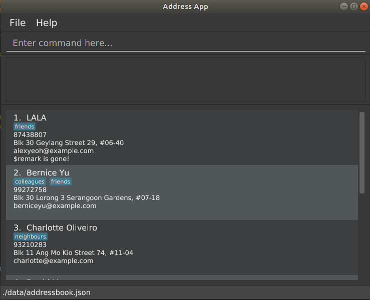

= CS2103/T Revision Tool - User Guide
:site-section: UserGuide
:toc:
:toc-title:
:toc-placement: preamble
:sectnums:
:imagesDir: images
:stylesDir: stylesheets
:xrefstyle: full
:experimental:
ifdef::env-github[]
:tip-caption: :bulb:
:note-caption: :information_source:
endif::[]
:repoURL: https://github.com/AY1920S1-CS2103-F10-3/main
:javaFxBugURL: https://github.com/javafxports/openjdk-jfx/pull/271

By: `Team F10-3`      Since: `Aug 2019`      Licence: `MIT`

== Introduction

This CS2103/T Revision Tool (RT) is for those who *prefer to use a desktop app for storing their personally
customised question banks*. More importantly, RT is *optimized for those who prefer to work with a Command Line
Interface* (CLI) while still having the benefits of a Graphical User Interface (GUI).
If you can type fast, RT can get your revision done faster than traditional quiz
GUI apps. Interested? Jump to the <<Quick Start>> to get started. Enjoy!

[NOTE]
RT is initially designed with the intention to help CS2103/T students who do not like to use Luminus quizzes
for their revision. However, it can also be used for other modules or other revision purposes, for students who
generally prefer a CLI and GUI that is different from what Luminus or other existing quiz apps have to offer.

== Quick Start

.  Ensure you have Java `11` or above installed in your Computer.
.  Ensure that you have the latest version of JavaFX installed in your Computer. (Previous versions of JavaFX may cause
bugs related to displaying pop ups. more info about this bug can be found at this link:{javaFxBugURL}/link[link])
.  Download the latest RT link:{repoURL}/releases[here].
.  Copy the file to the folder you want to use as the home folder for your `*question bank*`.
.  Double-click the file to start the app. The GUI should appear in a few seconds. The image below shows the app in configuration mode.
+

+
.  Type the command in the command box and press kbd:[Enter] to execute it. +
.  Some example commands you can try in configuration mode:

* *`list`* : lists all categories and difficulties for the user to choose.
* **`add `**`type/mcq q/According to the textbook, which kind of project is more difficult? x/Greenfield x/Brownfield y/None
of the above x/Padifield diff/1 cat/Introduction` : adds an mcq question with x/ (as in a cross for "wrong") marking the wrong answers and
y/ (as in "yes") marking the correct answers. Difficulty: 1, Category: Introduction.
* **`delete`**`3` : deletes the 3rd question shown in the current list.
* *`exit`* : exits the app.

.  Refer to <<ConfigurationMode>> for details of each command.

. To enter Quiz Mode, type `start mode/normal` other modes such as arcade and custom are also available and are elaborated
in <<Quiz Mode>> .
+
image::Ui2.png[width="790"]
+
e.g. typing *`help`* and pressing kbd:[Enter] will open the help window.

[[ConfigurationMode]]
== Configuration Mode

====
*Command Format*

* Words in `UPPER_CASE` are the parameters to be supplied by the user e.g. in `add type/TYPE q/QUESTION`, 'TYPE' and `QUESTION` are parameters
which can be used as `add type/mcq q/What the recommended user story format?`.
* Items with `…`​ after them can be used multiple times including zero times e.g. `[x/WRONG_ANSWER]...` can be used as `{nbsp}` (i.e. 0 times), `x/Greenfield`, `x/Brownfield` etc.
* Parameters can be in any order e.g. if the command specifies `q/QUESTION cat/CATEGORY`, `cat/CATEGORY q/QUESTION` is also acceptable.
====

=== Viewing help : `help`

Format: `help`

//tag::wilfred[]
//tag::wilfred-start[]
=== Starting the quiz: `start`.

User can start by choosing the mode of the quiz. (normal / arcade / custom). See <<Quiz Mode>> for in-quiz commands.

Format: `start mode/MODE`

[TIP]
To start all questions in the question bank, use command +
start mode/normal

Examples:

* `start mode/normal`
* `start mode/custom cat/uml /diff/1 timer/20`
//end::wilfred-start[]

//tag::khiangleon[]
//tag::khiangleon-stats[]
=== Check your progress: `stats`

+
image::stats.png[width="790"]
+

Displays the percentage of questions answered correctly by difficulty, for all
quiz attempts. Indicates to user which difficulty level he or she is weakest in.
This feature only records results for the normal mode of quizzes.

Format: `stats`

Example:

*Total*: 68.42%

* Difficulty 1: 100.00%
* Difficulty 2: 100.00%
* Difficulty 3: 14.29%
* Please prioritise this type of questions: Difficulty 3

//end::khiangleon-stats[]

//tag::shaun[]
//tag::shaun-autocomplete[]
=== AutoComplete Function

Helps you complete your command when you type.

Users will be able to see a list of auto complete options while they are typing. Once the auto complete context menu is
shown, users can use the arrow keys to choose the options they want and upon pressing the "ENTER" button, they would be able to
select the option.

Examples:

* `User wants to type the "start" command in the command box`
* `He will be able to see a list of dropdown options as shown:`
* `First "ENTER" button will select the option`
* `Second "ENTER" button will execute the option`
+
image::Autocomplete2.png[width="790"]
//end::shaun-autocomplete[]

//tag::wilfred-add[]
=== Adding a question: `add`

Adds a question to the question bank

Format: `add type/TYPE q/QUESTION cat/CATEGORY diff/DIFFICULTY y/CORRECT_ANSWER x/WRONG_ANSWER... `

****
[%hardbreaks]
The following are the valid answer formats for each question type:
*MCQ*: 1 Correct answer and 3 Wrong answers.
*True & False*: 1 Correct answer (i.e. True / False) wrong answers omitted.
*SAQ*: Multiple correct answers, no wrong answers.
****

Examples:

* `add type/mcq q/According to the textbook, which kind of project is more difficult? cat/Week 2 diff/1
x/Greenfield x/Brownfield y/None of the others x/Padifield`
* `add type/tf q/OODMs are Class Diagrams cat/uml diff/2 y/true`
* `add type/saq q/What does UML stands for? cat/cs2103 diff/1 y/unified modeling language`
//end::wilfred-add[]

//tag::wilfred-edit[]
=== Editing a question : `edit`

Edits an existing question in the question bank.

Format: `edit INDEX [q/QUESTION] [cat/CATEGORY] [diff/DIFFICULTY] [x/WRONG_ANSWER]... [y/CORRECT_ANSWER]...`

****
* Edits the question at the specified `INDEX`. The index refers to the index number shown in the displayed question list.
The index *must be a positive integer* 1, 2, 3, ...
* At least one of the optional fields must be provided.
* Existing values will be updated to the input values.
* When editing category and/or difficulty, the existing category and/or difficulty of the question will be removed
i.e adding of category and/or difficulty is not cumulative.
****

Examples:

* `edit 1 q/According the the textbook, is greenfield or brownfield tougher?` +
Edits the the first question to "According the the textbook, is greenfield or brownfield tougher?"
//end::wilfred-edit[]

=== Deleting a question : `delete`

Deletes the specified questions from the question bank. +
Format: `delete INDEX [MORE_INDICES]`

****
* Delete the question(s) at the specified `INDEX`s.
* The index refers to the index number shown in the displayed question list.
* The index *must be a positive integer* 1, 2, 3, ...
****

Examples:

* `list` +
`delete 2` +
Deletes the 2nd question in the question bank list.
* `find Greenfield` +
`delete 1 3 5` +
Deletes the 1st, 3rd and 5th question in the question bank list.

=== Listing all questions : `list`

Shows a list of all questions in the test back. If appended with a category and/or difficulty, `*Insert name*` will show all questions
of the chosen category and/or difficulty

Format: `list [cat/CATEGORY] [diff/DIFFICULTY]`

[TIP]
If no category or difficulty is stated (i.e. `list`), program will list the entire question bank.

Examples:

* `list cat/requirements`
* `list cat/requiments diff/2`

=== Locating questions: `find`

Finds questions whose descriptions contain any of the given keywords. +
Format: `find KEYWORD [MORE_KEYWORDS]`

****
* The search is case insensitive. e.g `brownfield` will match `Brownfield`
* The order of the keywords does not matter. e.g. `green field` will match `field green`
* Only the name is searched.
* Only full words will be matched e.g. `Requirement` will not match `Requirements`
* Descriptions matching at least one keyword will be returned (i.e. `OR` search). e.g. `User story` will return `User Survery`, `User Input`
****

Examples:

* `find User` +
Returns `How do you gather user requirements?` and `What is the recommended user story format?`
* `find User, Brownfield, Greenfield` +
Returns any question containing descriptions `User`, `Brownfield`, or `Greenfield`

=== Clearing all entries : `clear`

Clears all questions from the question bank. +
Format: `clear`

//tag::shaun-restore[]
=== Restoring all entries : `restore`

Clears all current questions from the question bank and restores the default questions that were in the original app. +
Users will be prompted if they really want to restore their current question bank as the command is non-reversible.
Format: `restore`
//end::shaun-restore[]

=== Saving the data

question bank data are saved in the hard disk automatically after any command that changes the data.
There is no need to save manually.

=== Exiting the application: `exit`

Exits the application. +
Format: `exit`

//tag::khiangleon[]
//tag::khiangleon-history[]
=== More data analytics `[coming in v2.0]`

==== More statistics `stats`
Users will be able to view average scores across all attempts of quizzes.
They will also be able to view statistics not just for difficulty levels, but also for individual categories.
This will help them to prioritise and know exactly which type of questions they are weaker at.
This feature will also indicate to users further that overall across all quiz attempts which type of questions
needs to be prioritised. In addition, with all these in mind, users can then make use of the custom quiz mode in
`section 4.3` to get more practise on specific types of questions.

==== Graphs `history`
Currently, as of `v1.4`, this command only shows a raw full history of scores and their breakdown
by difficulty levels for all past quiz attempts. The number of quizzes attempted by the user in total is also shown
in the results display. By `v2.0`, users will be able to view line graphs of their history of quiz attempts' results
by categories and difficulty levels. This will show them how much they are progressing in their quiz results for
each different type of questions.

//end::khiangleon-history[]

// tag::import/export[]
=== Importing / Exporting question banks `[coming in v2.0]`

User can export can import json files containing the question bank into the application.
// end::import/export[]

=== Hints `[coming in v2.0]`

User will be able to get hints for MCQs and SAQs. Typing '/hint' for MCQs will eliminate two wrong answers from the
options, leaving user with two options, one of which is correct. Typing '/hint' for SAQs will show the user random
keywords from the correct answer list.

//tag::wilfred-quiz[]
== Quiz Mode

=== Normal Mode
Levels are separated by difficulty. At the end of each level, user has the choice to move on to the next level or exit the quiz.
The user is given 30 seconds to answer each question.

image::normal-mode.png[]

=== Arcade Mode
Levels are separated by difficulty. If the user enters a wrong answer before finishing the quiz. The quiz will end and display the results.
The user is given 30 seconds to answer each question in level 1. Subsequent level timers are 5 seconds faster than the previous level with
level 3 giving the user 20 seconds to answer each question.

image::arcade-mode.png[]

=== Custom Mode
Category, Difficulty and Timer (must be above 1 second) can be customised by the user. Levels are also sorted according to
difficulty.

=== Answering Questions
|======
|MCQ |TrueFalse |SAQ
|Answers can only be A, B, C, or D (Case insensitive) |Answers can only be True (T) / False (F) (Case insensitive)|Answers are open ended. Revision tool uses NLP to parse answers and determine whether they are correct.
|======
//end::wilfred-quiz[]

=== Exiting the quiz

User can end the quiz and go back into Configuration Mode (see <<ConfigurationMode>>) to perform commands such as `add`, `list`, and `stats`
.

Format: `exit`

== FAQ

*Q*: How do I transfer my data to another Computer? +
*A*: Install the app in the other computer and overwrite the empty data file it creates with the file that contains the
data of your previous question bank folder.

*Q*: Why am I not able to click on the options to select the answers for MCQs and T/F questions? +
*A*: The options are there as a way to show the users the options available. As this is a CLI application, the main
input will be through keyboard inputs.

*Q*: Can I use this application for another module? +
*A*: Yes you can. This application is designed to store any types of MCQs, T/F and SAQs.

*Q*: I want to challenge my friends using this application, how can I do it? +
*A*: There is no online support for the application right now. One way you can chanllenge your friend is to prepare the
same json files and load it up to your individual computers and do the quiz together.

//tag::wilfred-summary[]
== Command Summary

* *Help* : `help`

* *Start* `start mode/MODE` +
e.g. `start mode/normal`

* *Exit* `exit`

* *Stats* : `stats`

* *Add* `add type/TYPE q/QUESTION cat/CATEGORY diff/DIFFICULTY y/CORRECT_ANSWER x/WRONG_ANSWER...` +
e.g. `add type/mcq q/According to the textbook, which kind of project is more difficult? cat/Week 2 diff/1
x/Greenfield x/Brownfield y/None of the others of the above x/Padifield`

* *Edit* : `edit INDEX [q/QUESTION] [cat/CATEGORY] [diff/DIFFICULTY] [x/WRONG_ANSWER]... [y/CORRECT_ANSWER]...` +
e.g. `edit 1 q/According the the textbook, is greenfield or brownfield tougher?`

* *Delete* : `delete INDEX [MORE_INDICES]` +
e.g. `delete 1 3 5`

* *List* : `list [cat/CATEGORY] [diff/DIFFICULTY]`
e.g. `list cat/requiments diff/2`

* *Find* : `find KEYWORD [MORE_KEYWORDS]` +
e.g. `find user story`

* *Clear* : `clear`

* *Restore* : `restore`

* *History* : `history`
//end::wilfred-summary[]
//end::wilfred[]

//tag::shaun-AcTip[]
[TIP]
*AutoComplete*: Suggested commands will be shown as you type. Navigate through the dropdown list using the up and down
arrow keys and hit kbd:[Enter] to complete the command.

//end::shaun-AcTip[]
//end::shaun[]

//tag::khiangleon-StatsTip[]
[TIP]
*Stats/History*: Hitting kbd:[Enter] again after executing a `stats` or `history` command will return you
back to configuration mode displaying the question bank.

//end::khiangleon-StatsTip[]
//end::khiangleon[]
