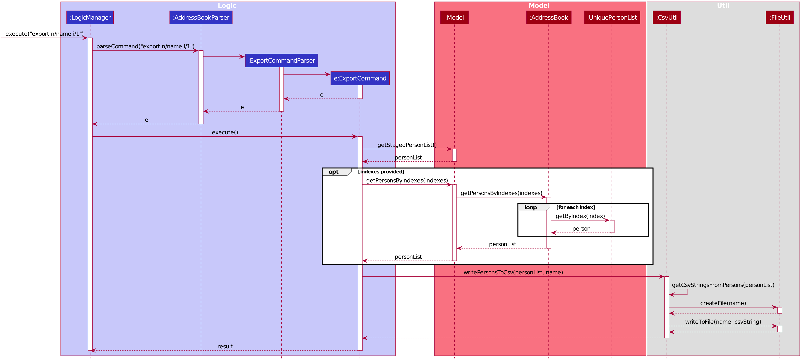

Import and export functionality are split into three commands:

1. `app-export`
2. `app-import-replace`
3. `app-import-merge`

==== Jackson Library

The current import and export features are built upon the the existing `Jackson` libraries,
in particular the `dataformat`, `databind` and `datatype` modules. Technical knowledge of the
`Jackson` library will be helpful for maintenance of feature, but is not necessary.

However, understanding `Jackson` 's `annotations` will be needed in order to extend export and import
functionality to cover new data fields or classes implemented in the future. They are explained
link:http://fasterxml.github.io/jackson-annotations/javadoc/2.7/[here].

==== Csv Processing

All of the data processing needed for this feature can be found in the `CsvUtil` file;
it is responsible for converting the data of `Patient` objects into a .csv friendly `String` format
and vice versa. The actual reading and writing of .csv files is then done with existing
`FileUtil` functionality.

The conversion of `Patient` objects to and from .csv formatted `Strings` are handled by
the `CsvMapper` and `CsvSchema` classes implemented in `dataformat`.

* The `CsvMapper` is responsible for managing custom configurations for the conversions.
For instance, it can toggle headers with `withHeader()` and skip unknown fields with the
`IGNORE_UNKNOWN` feature, both of which are used in the feature implementation.
* The `CsvSchema` object is created by a configured `CsvMapper` object and an `Object.class`,
in this case, `Patient.class`. It dictates the scheme for how data in each column of the .csv
corresponds with the fields in the Object class. This schema can then be used to instantiate
a reader or a writer object.

The following functions are implemented:

1. `CsvUtil#writePatientsToCsv(List<Patient>, String)` -- Write
a list of `Patient` objects into a .csv file with specified `exportFileName`.
If successful, return the path of the written file.
2. `CstUtil#readPatientsFromCsv(String)` -- Read a .csv file with specified
`importFileName` and return a corresponding list of `Patient` objects.
3. `importsAreUnique(List<Patient>)` -- Check if the patients in a given list are unique, i.e. the list
contains no duplicate patients.

==== Csv Processing Design Considerations
* **Alternative 1 (current choice)**: Use `Jackson` 's `dataformat.csv` library.
** Pros: Well integrated with the existing `Jackson` JSON parsing libraries. Tons of functions for CSV parsing.
** Cons: Does not support Excel formats. Comprehensive library, recently updated but not well-documented. Hard to understand.

* Alternative 2: Use other libraries, like Apache Commons CSV.
** Pros: More features like Excel format parsing. Well documented.
** Cons: Does not integrate well with the existing `Jackson` libraries used.

* Alternative 3: Build your own parser!
** Pros: Lightweight, implement only what is needed. Can be white box tested.
** Cons: Lots of developer work to reinvent the wheel.
Likely to be buggy as there are tons of edge cases to consider, due to many special characters.

==== Command Implementation

===== Command: `app-export`

The `app-export` command works by retrieving a list of `Patient` objects from the `Model` and
passing it to `CsvUtil` to process and write into a .csv file. If provided with indexes, the
`app-export` feature can selectively export the `Patient` objects that correspond to the
specified indexes.
To facilitate the selective export functionality, the following methods were implemented in
`Model` and `PatientBook`.

* `Model#GetPatientsByIndexes(Set<Indexes>)` -- Retrieves and returns a list of `Patient` objects
corresponding to the provided indexes from the `PatientBook` , if the indexes are valid.
* `PatientBook#GetPatientByIndex(Index)` -- Returns the `Patient` object corresponding
to the specified index, if the index is valid.

If indexes are not specified in the command arguments, a list of all currently existing `Patient`
objects will be retrieved with `Model#getStagedPatientList()`.

The `app-export` command MUST be provided with a desired file name for the .csv file. The .csv
file will be written to `/exports/filename.csv`. Existing files will NOT be overridden and
thus the provided file name cannot already exist in `/exports`.

The following diagrams show how an export command works:

.Export Sequence Diagram

.Reference: get patient list
image::ExportSequenceDiagramRef.png[width="700"]
.Reference: write patients to csv file
image::ExportSequenceDiagramRef2.png[width="700"]

===== ExportCommand Design Considerations

====== Aspect: File Overriding

* **Alternative 1 (current choice)**: Disallow overriding, file name provided must be new
** Pros: Existing .csv files will not be accidentally overridden. Prevents potential loss of data.
** Cons: Additional hassle for the user to delete files that they want to replace.

* **Alternative 2**: Allow overriding
** Pros: Conveniently replace existing, unused files.
** Cons: May accidentally override and lose important data.

===== Aspect: Illegal Characters in Data Fields

* **Alternative 1 (current choice)**: Allow forbidden characters
** Pros: Certain fields may be more accurately represented, i.e. addresses.
** Cons: The exported csv file may be bugged in edge cases, i.e. have data in the wrong columns.
Exported fields with forbidden characters may not be properly handled and escaped all of the time.
More developer work to test around edge cases.

* **Alternative 2**: Disallow forbidden characters
** Pros: Exported .csv files are guaranteed to be in the correct format.
** Cons: Data fields are restricted and cannot have commas, semi-colons, etc.

===== Import

The import commands work by reading a .csv file and converting it into a list of `Patient`
objects by using `CsvUtil`. The list is then passed to `Model`. What happens next depends
on which variant of import is called.

For both variants of the command, the imported list of patients CANNOT have any duplicates.
This is ensured with `CsvUtil#importsAreUnique(List<Patient>)`.

====== Command: `app-import-replace`

The `Model` will replace all existing `Patient` data in the `PatientBook` with the data
of the new list of `Patient` objects. To do this, the following was implemented:

* `Model#replaceStagedPatientBook(List<Patient>)` -- Creates a new `PatientBook` object
containing the `Patient` objects in the provided list. The old `PatientBook` stored in the
`Model` is then replaced with the new `PatientBook` by calling
`Model#setStagedPatientBook(PatientBook)`.

====== Command `app-import-merge`

The `Model` will add all `Patient` data in the new list of `Patient` objects into the
`PatientBook`. To do this, the following was implemented:

* `Model#hasAnyPatientInGivenList(List<Patient>)` -- Checks if the model contains
any `Patient` in the given list of `Patient` objects.
* `Model#addPatients(List<Patient>)` -- Adds all `Patient` objects in the given list
into the `Model`.

If the operation will result in duplicate `Patient` objects in the `PatientBook`,
it will not be executed. This is checked by the function stated above,
`Model#hasAnyPatientInGivenList(List<Patient>)`.

===== Import Design Considerations

====== Aspect: Allowing Patient Overriding for `app-import-merge`

* **Alternative 1 (current choice)**: Disallow overriding.
** Pros: Existing `Patient`  will not be accidentally overridden.
No need to deal with potential merge conflicts.
** Cons: User may have intended to use `app-import-merge` to update old data.
More hassle for the user to delete old `Patient` data that they want to replace.

* **Alternative 2**: In case of duplicates, replace old `Patient` data.
** Pros: Conveniently update old `Patient` data.
** Cons: May accidentally override and lose important data, though not a big deal
with `app-undo`.

* **Alternative 3**: Implement a flag to toggle overriding.
** Pros: Best of both worlds.
** Cons: More coding and debugging work.
