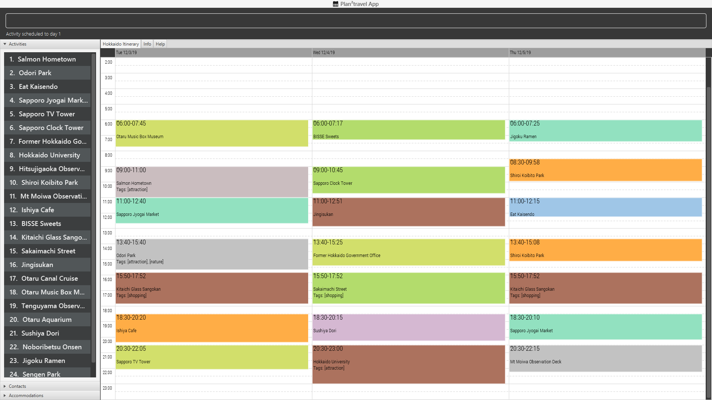

= Leong Sheu Xiang - Project Portfolio
:site-section: AboutUs
:imagesDir: ../images
:stylesDir: ../stylesheets

== PROJECT: *_Plan²travel_*

---

== Overview

*_Plan²travel_* is a travel planning application built for desktops. The program supports a GUI interface built with JavaFX but most user interactions should happen from a Command Line Interface(CLI). It is a  Java application intended for students travelling to an overseas country. The program helps users quickly organise their travel information, schedule their activities and create a visually appealing itinerary.

Below is a screenshot of our application:

== Summary of contributions

* *Major enhancement 1*: added *autocompletion of commands*
** What it does: gives the user suggestions of how to complete the command input. Users can select the suggestions and the input will have the suggestion added.
** Justification: There are many commands to learn to be proficient in the program. This gives new users more confidence when using the program and also allows advanced users to save time when typing commands. Also it prevents mistakes in spelling, especially when it comes to words like "accommodation" and "itinerary".
** Highlights: This enhancement requires a good understanding of the different variations of command syntax in the program to be able to come up with a general way to narrow down the possible suggestions.

** Credits:  Caleb Brinkman for providing a code base to start the autocomplete feature at https://gist.github.com/floralvikings/10290131. The code had to be modified as the original autocomplete feature by Brinkman was more suited for dictionary words rather than for commands.

* *Major enhancement 2*: added the *itinerary*

** What it does: Allow the itinerary to update and show the current activities on the itinerary.
** Justification: Allow the user to be able to immediately see how the scheduled activities look like on a timetable and be able to better plan their itineraries.
** Highlights: This enhancement required a good understanding of Agenda from the JFXtras library. Since the default timetable provided by Agenda was edited mostly by mouse clicks, modifications had to be made to Agenda. Also, the default Agenda displayed a static amount of days and further modifications had to be made for it to adapt to changing number of days.

* *Minor enhancement*: added the model for *Day* and *ActivityWithTime*

** What it does: Provides the underlying data structure for each day in the itinerary. ActivityWithTime is a higher-level wrapper of Activity that contains the starting time of the activity.
** Justification: An itinerary is naturally composed of days, hence it was helpful when using it to store activities that have been scheduled on a particular day.
** Highlights: This enhancement interacts with the itinerary UI and different considerations had to be made to ensure the UI will be able to accurately display what was saved in the each day.

* *Functional Code contributed*:

** Enhanced the GUI (Pull requests https://github.com/AY1920S1-CS2103T-T09-1/main/pull/109[#109], https://github.com/AY1920S1-CS2103T-T09-1/main/pull/126[#126], https://github.com/AY1920S1-CS2103T-T09-1/main/pull/207[#207], https://github.com/AY1920S1-CS2103T-T09-1/main/pull/212[#212])

* *Test Code contributed*:

* *Other contributions*: Coded the redesign from AddressBook to plan2travel. Also, added functionality to allow information about activity, accommodation, contact and day to be displayed in the info tab via `list activity/accommodation/contact/day` or through `view activity/accommodation/contact`.

** Community:
*** PRs reviewed (with non-trivial review comments): https://github.com/AY1920S1-CS2103T-T09-1/main/pull/72[#72], https://github.com/AY1920S1-CS2103T-T09-1/main/pull/74[#74], https://github.com/AY1920S1-CS2103T-T09-1/main/pull/82[#82], https://github.com/AY1920S1-CS2103T-T09-1/main/pull/87[#87], https://github.com/AY1920S1-CS2103T-T09-1/main/pull/94[#94], https://github.com/AY1920S1-CS2103T-T09-1/main/pull/99[#99], https://github.com/AY1920S1-CS2103T-T09-1/main/pull/100[#100], https://github.com/AY1920S1-CS2103T-T09-1/main/pull/106[#106], https://github.com/AY1920S1-CS2103T-T09-1/main/pull/117[#117], https://github.com/AY1920S1-CS2103T-T09-1/main/pull/122[#122], https://github.com/AY1920S1-CS2103T-T09-1/main/pull/134[#134], https://github.com/AY1920S1-CS2103T-T09-1/main/pull/193[#193], https://github.com/AY1920S1-CS2103T-T09-1/main/pull/216[#216], https://github.com/AY1920S1-CS2103T-T09-1/main/pull/241[#241]
*** Reported bugs and suggestions for other teams in the class (examples:  https://github.com/AY1920S1-CS2103T-T11-2/main/issues/163[1], https://github.com/AY1920S1-CS2103T-T11-2/main/issues/164[2], https://github.com/AY1920S1-CS2103T-T11-2/main/issues/165[3], https://github.com/AY1920S1-CS2103T-T11-2/main/issues/166[4], https://github.com/AY1920S1-CS2103T-T11-2/main/issues/167[5], https://github.com/AY1920S1-CS2103T-T11-2/main/issues/168[6], https://github.com/AY1920S1-CS2103T-T11-2/main/issues/169[7])
** Tools:

=======
*** Integrated a third party library (JFXtras) to the project (https://github.com/AY1920S1-CS2103T-T09-1/main/pull/109[#109])

//== Contributions to the User Guide
//
//
//|===
//|_Given below are sections I contributed to the User Guide. They showcase my ability to write documentation targeting end-users._
//|===
//
//include::../UserGuide.adoc[tag=delete]
//
//include::../UserGuide.adoc[tag=dataencryption]
//
//== Contributions to the Developer Guide
//
//|===
//|_Given below are sections I contributed to the Developer Guide. They showcase my ability to write technical documentation and the technical depth of my contributions to the project._
//|===
//
//include::../DeveloperGuide.adoc[tag=undoredo]
//
//include::../DeveloperGuide.adoc[tag=dataencryption]

