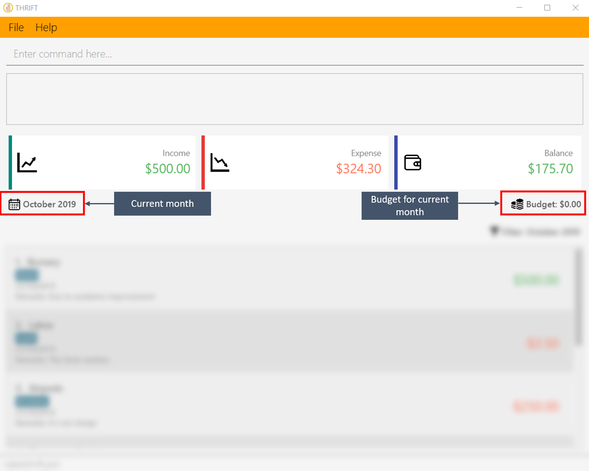
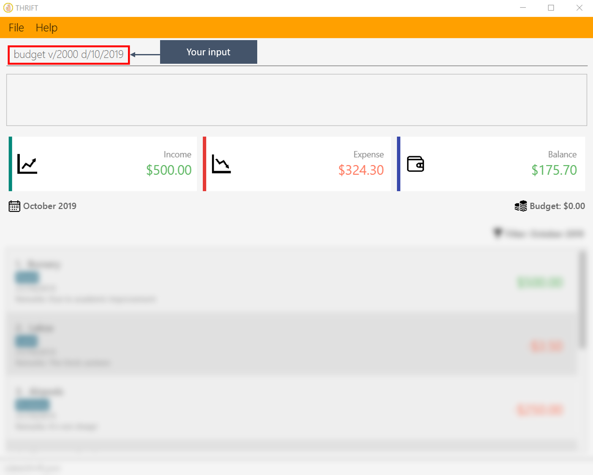
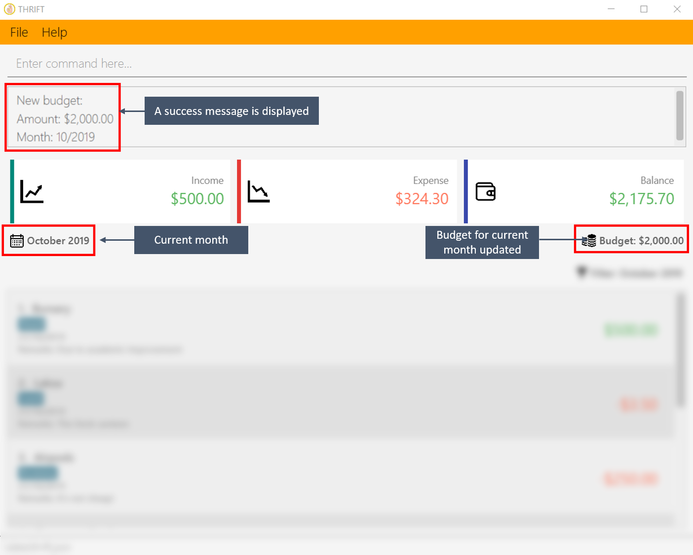
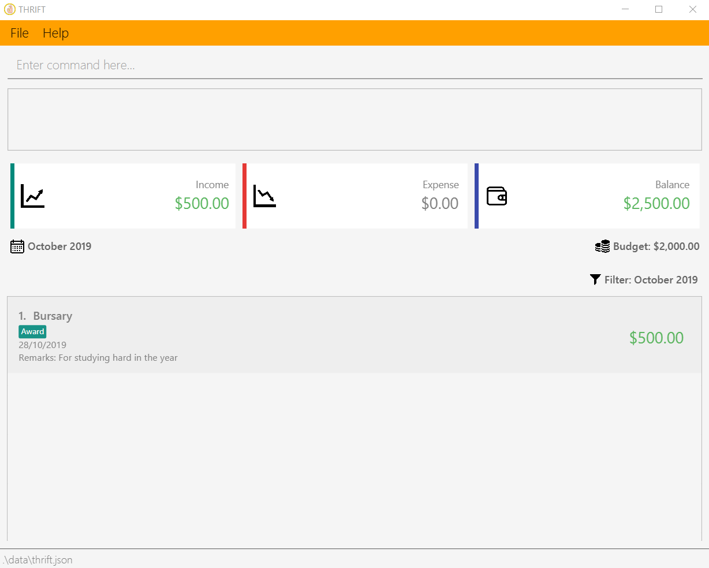
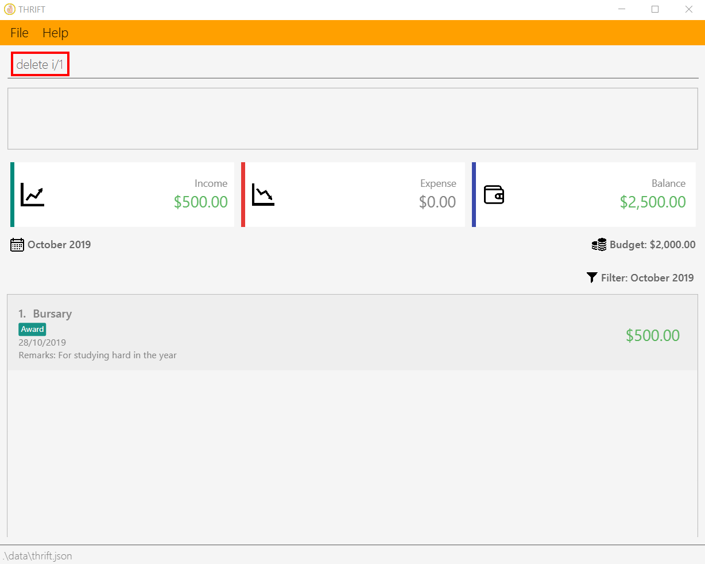
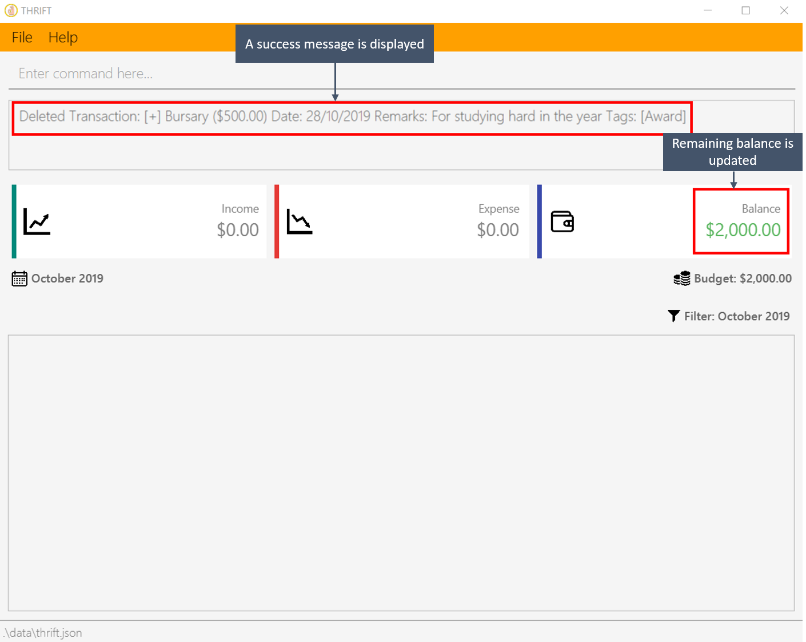

= Poh Jia Hao - Project Portfolio
:site-section: AboutUs
:imagesDir: ../images
:stylesDir: ../stylesheets

== 1. Introduction
=== 1.1 Purpose
This portfolio serves as a showcase of my roles and contributions to the team project `**THRIFT**`. This project was part of
the requirements of a year two software engineering module that I have taken as an undergraduate in NUS.

=== 1.2 Project: `**THRIFT**`
`**THRIFT**` is a finance tracker desktop application targeting money-conscious NUS students who wish to keep
their spending in check. It allows its users to set a budget for each month and track incoming and outgoing transactions. This would remind the user
not to overspend as they will constantly see their remaining balance for that month. The following image is what `**THRIFT**` looks like:

.Main window of `**THRIFT**` which shows the user's balance as well as transactions
image::../images/Ui.png[,550]

=== 1.3 Background
`**THRIFT**` is morphed from the original https://github.com/nus-cs2103-AY1920S1/addressbook-level3[AddressBook-Level3] application which allows users to add contacts,
creating a personalised list. My team and I have since transformed the application to better suit our purpose.

In this project, I was the team lead and was primarily in charge of spearing the direction of the `**THRIFT**`.
This meant that managing project milestones, deadlines and delegating work to different team members were part of my
responsibilities.

My team members took on the roles of "User Experience Developer", "Process Analyst", "Quality Assurance Manager" and "Software Architect".
We all had important and major roles to play in order to ensure that `**THRIFT**` is successful.

=== 1.4 Legend
There are various text styles used in this portfolio and its usages are explained below.

NOTE: This symbol denotes information that you may want to take note of when using the application.

TIP: This symbol denotes a tip which you may find useful when using the application.

As our User Guide and Developer Guide are formatted differently, you should refer to their respective formatting guide below:

[horizontal]
User Guide: :: <<../UserGuide#features, Formatting>> of the User Guide
Developer Guide: :: <<../DeveloperGuide#about-the-document, Formatting>> of the Developer Guide

== 2. Summary of Contributions
This section provides a summary on the contributions I made to `**THRIFT**`.

=== 2.1 Enhancements made
**Add transactions into the transaction list**

The **add_expense**/**add_income** command allows the user to track their incoming and outgoing transactions.

* Highlights: This command allows the user to optionally annotate each transaction with a `**Remark**` and `**Tag**`.

**Set budget for a specified month**

The **budget** command allows the user to set their budget for a particular month. This allows them to see if
they are within their spending limit for the month.

** Highlights: The user can change the budget at any time and their remaining balance would update accordingly.

=== 2.2 Code contributed
* [https://github.com/AY1920S1-CS2103T-W12-2/main/commits/master?author=limerencee[Commits]] [https://github.com/AY1920S1-CS2103T-W12-2/main/pulls?utf8=%E2%9C%93&q=is%3Amerged+is%3Apr+author%3Alimerencee+[Pull requests]] [https://nus-cs2103-ay1920s1.github.io/tp-dashboard/#search=limerencee&sort=groupTitle&sortWithin=title&since=2019-09-06&timeframe=commit&mergegroup=false&groupSelect=groupByRepos&breakdown=false[RepoSense Code Contribution Dashboard]]

=== 2.3 Other contributions
* Project management:
** There were a total of 5 releases, from version 1.0 to 1.4. I managed every release on https://github.com/AY1920S1-CS2103T-W12-2/main/milestones[GitHub].

* Enhancement to existing features:
** Refactored the original AddressBook-Level3 codebase to fit our requirements. (Pull request https://github.com/AY1920S1-CS2103T-W12-2/main/pull/62[#62])
** Updated the original **delete** command to require a prefix **i/INDEX** to specify which transaction the user wishes to delete.
This makes the **delete** command syntax consistent with the **update** command. (Pull request https://github.com/AY1920S1-CS2103T-W12-2/main/pull/104[#104])
** Updated the original **find** command to search for the specified keyword(s) in a transaction's `**Remark**` as well as `**Description**`. (Pull request https://github.com/AY1920S1-CS2103T-W12-2/main/pull/163[#163])

* Documentation:
** Updated the original developer guide to suit the context of `**THRIFT**`. (Pull request https://github.com/AY1920S1-CS2103T-W12-2/main/pull/169[#169])

* Community:
** Reviewed pull requests with (non-trivial comments): https://github.com/AY1920S1-CS2103T-W12-2/main/pull/69[#69], https://github.com/AY1920S1-CS2103T-W12-2/main/pull/168[#168], https://github.com/AY1920S1-CS2103T-W12-2/main/pull/174[#174], https://github.com/AY1920S1-CS2103T-W12-2/main/pull/175[#175]

== 3. Contributions to the User Guide
The following sections illustrate my ability in writing documentation targeting end-users which guides them in using the various features of the application.

=== Setting monthly budget: `budget`

You are able to set a budget for each month in THRIFT. This allows THRIFT to display your remaining balance for the month and lets you keep your spending in check.

NOTE: It is not compulsory to set a budget for each month and you can use THRIFT normally without setting budgets.

==== Command syntax:
`budget v/VALUE d/MONTH`

****
* Sets your budget for the month specified in `MONTH` as `VALUE`.
* `VALUE` is any positive integer below one billion.
* `MONTH` is in `MM/YYYY` and `MM` is between `01-12`.
****

==== Example usage:

You wish to set your budget for the month _October 2019_ as $_2000_:

. Your current budget for the month _October 2019_ is $_0_.
+

. You type: **budget v/2000 d/10/2019** in the command box and press kbd:[Enter].
+

. You should see in the result box that your budget for _October 2019_ has been set to $_2000_.
+

NOTE: If you are changing your budget for the current displayed month, you should see the changes on the GUI immediately.

=== Deleting a transaction: `delete`
If you find that a transaction is no longer relevant to you, you may delete it from THRIFT.

==== Command syntax:
`delete i/INDEX`

****
* Deletes the transaction with the specified `INDEX` as shown on the transaction list GUI.
* `INDEX` *must be a positive integer* 1, 2, 3, ...
****

==== Example usage:
Assume that you wish to delete a bursary income transaction from your transaction list because the bursary was mistakenly awarded to you.

. This transaction is currently the first transaction in your transaction list.
+

. You type: **delete i/1** and press kbd:[Enter].
+

. You should see that the bursary transaction has been deleted from THRIFT and your balance has been updated accordingly.
+

== 4. Contributions to the Developer Guide
The following sections illustrate my ability in writing documentation to provide developers insights on the design of the application. It also showcases the technical depth of my contributions to the project.

=== Adding transactions
We allow users to add `**Expense**`/`**Income**` transactions into `**THRIFT**` which enables record-keeping. This section will show how we handle such
requests from the user at the back-end.

==== Implementation
We store every single `**Transaction**` added by the user into an `**ObservableList<Transaction>**`, which is a list object in `**TransactionList**`. We used an `**ObservableList**` because whenever there are changes to the list, any other component
of `**THRIFT**` using it will automatically reflect its changes.

We implemented adding a `**Transaction**` through the following commands: **add_expense**/**add_income**. This process leverages on polymorphism: `**Expense**` and `**Income**` are both subclasses of the abstract class `**Transaction**`.
Each `**Transaction**` contains the following mandatory fields: `**Description**`, `**TransactionDate**` and `**Value**`; as well as optional fields: `**Remark**`,
and `**Set<Tag>**`. The following class diagram depicts this relation:

image::add-transaction/Polymorphism.png[,125]

Because of this polymorphism relation, many of the driver functions in `**THRIFT**` simply references `**Transaction**` and it will work for both `**Expense**`
and `**Income**` transaction objects. For example, when inserting a new `**Expense**`/`**Income**`, the `**AddTransactionCommandParser**` will determine
which object to initialize. The sequence diagram below shows how adding a `**Transaction**` work in the back-end:

.Sequence diagram of how adding a new `Transaction` is processed with polymorphism
image::add-transaction/PolymorphismCalling.png[,500]

`**Expense**` and `**Income**` are normally instantiated by either `ExpenseCommandParser#parse(String args)` or `IncomeCommandParser#parse(String args)`, which
attempts to parse the various parameters supplied in `args` and return either a `**Expense**` or `**Income**` object. The following conditions will cause a `**ParseException**`
to be thrown by the parser:

. Missing parameters
. Incorrect syntax (i.e. missing prefix, if it is required)
. Illegal values in parameters (i.e. special characters and symbols entered for a integer-only field)
. Multiple occurrences of parameters which only expects a single entry

[NOTE]
If the user input is incorrect due to any of the reasons above, the usage syntax will be shown.

We will demonstrate how a `**Transaction**` is added into `**THRIFT**` and how the back-end handles each step of the process:

Step 1. The user executes **add_expense n/Laksa v/3.50** to insert an `**Expense**` with its `**Description**` set to "Laksa"
and its `**Value**` set to "3.50". The `**TransactionDate**` is set to the user's current system date in the form "dd/mm/yyyy".
The input is now checked and an attempt to parse each parameter occurs:

* `**Description**` is parsed by `AddTransactionCommandParser#parseTransactionDescription(ArgumentMultimap)`
* `**Value**` is parsed by `AddTransactionCommandParser#parseTransactionValue(ArgumentMultimap)`
* `**TransactionDate**` is instantiated by `AddTransactionCommandParser#parseTransactionDate()`

NOTE: `**ArgumentMultimap**` is a class that stores all the parsed parameters taken from the user input.

Since the user input is valid, the `**Expense**` is successfully created and inserted into the transaction list.
The transaction list now contains 1 `**Transaction**` object.

image::add-transaction/AddTransaction1.png[,350]

Step 2. The user executes **add_income n/Bursary v/500 r/Awarded for doing well in school** to insert an `**Income**`.
The input is now checked in a similar fashion as in Step 2 except that:

* `**Remark**` is parsed by `AddTransactionCommandParser#parseTransactionRemark(ArgumentMultimap)`

Again, since the input is valid, the `**Income**` is successfully added into the transaction list. The transaction list
now contains 2 `**Transaction**` objects.

image::add-transaction/AddTransaction2.png[,350]

The following activity diagram summarizes what happens when the user executes a command to add a new `**Transaction**`:

.Activity diagram of adding a `**Transaction**` into the transaction list
image::add-transaction/AddTransactionActivity.png[, 500]

==== Design considerations
There are many different ways to implement how a transaction is added into `**THRIFT**`. In this section, we will be
justifying why we chose to implement it the way we did.

===== Aspect: Differentiating between `**Expense**` and `**Income**`
* **Alternative 1: (current choice):** Introduce a `**Transaction**` parent class which both `**Expense**` and `**Income**`
extends from.
** Pros: Introduces polymorphism, easing references to either classes by simply referencing the `**Transaction**` object.
For example, using a single `**List<Transaction>**` instead of needing 2 separate lists `**List<Expense>**` and `**List<Income>**`.
** Cons: Reduces the readability of the program as polymorphism can be confusing.

* **Alternative 2:** Keep `**Expense**` and `**Income**` classes separate, with each having their own specialized methods.
** Pros: Maintains an intuitive design: `**Expense**` deducts money and `**Income**` increases money.
** Cons: Incurs significant overhead and duplicated codes since it is likely that both `**Expense**` and `**Income**` will
have very similar methods.

Alternative 1 was chosen because we want to model it close to the real world: both `**Expense**` and `**Income**` are described
as being a `**Transaction**`.

===== Aspect: Managing how `**Value**` is stored and handled in `**Expense**` and `**Income**`
* **Alternative 1: (current choice):** Disallow negative `**Value**` in `**Expense**` object, only using positive amount
for both `**Expense**` and `**Income**`
** Pros: Removes the need to implement support for inserting negative `**Value**`. This is due to how `**Value**` constraints
are applied when restoring `**THRIFT**` data from the data file.
** Cons: Requires the developer to manually negate the `**Value**` whenever calculations are done with a `**Expense**` object.

* **Alternative 2:** Allow only negative amount in `**Expense**` object and only positive amount in `**Income**` object
** Pros: Calculating the balance becomes trivial - simply sum up the entire `**List<Transaction>**`.
** Cons: Parsing the user input to allow only a single negative symbol and no other symbols causes an overhead.

Alternative 1 was chosen because we want to keep the transaction list clean - only positive integers are stored.
