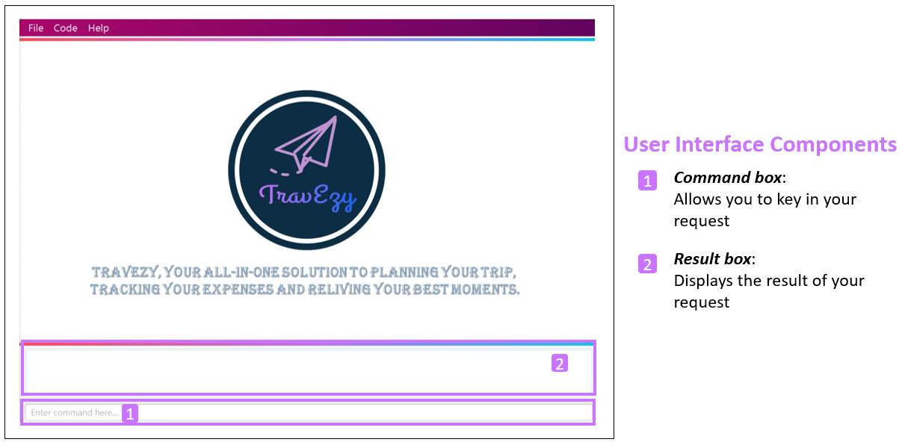

:site-section: AboutUs
:toc:
:toc-title:
:toc-placement: preamble
:sectnums:
:imagesDir: ../images
:stylesDir: ../stylesheets
ifdef::env-github[]
:tip-caption: :bulb:
:warning-caption: ⚠️
:note-caption: :information_source:
endif::[]

= Ng Zhao Ming - Project Portfolio

== Introduction

This project portfolio serves to note down my contributions to a team-based software engineering project in the
NUS Computing module, CS2103T. During this module, my team of 5 were given six weeks to either
_morph_ or _enhance_ an existing Java project,
https://github.com/nus-cs2103-AY1920S1/addressbook-level3[Address Book - Level 3].

=== Project Motivation

There are certain module requirements that our team have to adhere to when developing our application.

*Constrains:*::

.  Our application has to cater to individuals who can type fast and have a preference for typing over
other forms of input.
. The product has to be https://www.techopedia.com/definition/24409/brownfield[_Brownfield_].

*Our Decision:*::
In order to address these requirements, we have collectively decided to _morph_
https://github.com/nus-cs2103-AY1920S1/addressbook-level3[Address Book - Level 3] into a Traveller's Diary, _TravEzy_.
 +

Here is how _Travezy_ will look when you first start it:

._TravEzy_ Interface

Highlights of _TravEzy_: +

. As seen in _Figure 1._, _TravEzy_ utilizes the https://www.techopedia.com/definition/3336/command-line[Command Line Interface (CLI)]
through the _command box_ and in turn, most user
interactions are mediated through commands keyed into _TravEzy_.
. Is a desktop application and can be accessed on the computer without the need of a web browser.

=== About the project - _TravEzy_

_TravEzy_ combines all the essential travelling application and present it as a single package. It is the ideal
all-in-one application to assist globetrotters in planning their schedule, tracking their finances and
relieving their best memories.

_TravEzy_ targets NUS students who loves to backpack across several countries. As a team of 5 NUS student
who have a passion for travel, we believe that we are better to understand and cater to the needs of our target audience.

Given that NUS students are constantly hustling and still love to find time to unwind and travel, _TravEzy_ is ideal
application for them to do so.
In addition, _TravEzy_ will also be useful for students who are embarking on their Semester Exchange Programmes
during their junior and senior years in NUS.

The list below highlights the main features _TravEzy_ has to offer:

. Calendar
. Itinerary
. Financial Tracker
. Address Book
. Diary

=== Overview of my role in _TravEzy_

I was tasked to implement the itinerary feature for TravEzy.
The itinerary helps users to organize their busy schedule through inputting of timed events.

The following sections illustrate these implementations in more detail. Besides that, I will also delve into the contributions
I have made in the documentations of _TravEzy's_ User and Developer guides.

Before we move on, I would like to highlight the symbols and text formatting that will be used in this document,
which aims to improve readability of this document.

[TIP]
A light bulb indicates that the enclosed text is a tip.

[IMPORTANT]
A warning sign indicates that enclosed text is important.

``command``: Text which is contained in a grey box (as can be seen on the left) refers to _commands_ that the user
can type into the _command box_ in order to interact with _TravEzy_

_Components_: Italicised text indicates that the text has a definition that is specific to the application.

*Highlight* Bold text is mainly used for headings

=== Summary of contributions

Here is a summary in order of importance on the contributions that I have made during the team project.

*Major enhancement:*::
*Itinerary Feature*
* What it does: +
** The Itinerary helps users to plan their schedule by organizing all their _Event Entries_ in a single convenient to access
_Event List_.

* Justification:
** According to a survey that we have conducted on the general NUS student population, an overwhelming 90 percent of the
responders indicated their need to organize their trip while travelling overseas. Therefore, the Itinerary provides
a platform for them to do so, together with other nifty features to improve the user's experience.
This makes _TravEzy's_ Itinerary the frontier of convenience.

* Highlights: +
Other than being able to add, delete, check and display event entries, _TravEzy's_ Itinerary also offers several
complex features to bring convenience to you when organizing your schedule. This includes: +
. Searching and sorting of events in the _event list_
. Ability to input your commands quicker through https://www.computerhope.com/jargon/a/autocomp.htm[autocomplete]

*Code contributed*::
. https://github.com/AY1920S1-CS2103T-T17-2/main/pull/12[Itinerary (v1.1)]. Implemented the basic commands for _TravEzy's_ Itinerary.
. https://github.com/AY1920S1-CS2103T-T17-2/main/pull/42[Itinerary (v1.2)]. Design the https://www.techopedia.com/definition/5435/graphical-user-interface-gui[Graphic User Interface (GUI)]
for the Itinerary page.
. https://github.com/AY1920S1-CS2103T-T17-2/main/pull/94[Itinerary (v1.3)]. Implemented the complex commands for _TravEzy's_ Itinerary.
. https://github.com/AY1920S1-CS2103T-T17-2/main/pull/205[Itinerary (v1.4)]. Refine Itinerary, fixed bugs and work on _TravEzy_ documentation.

*Minor enhancement:*::
*_TravEzy_ Design* +
** Designed the https://github.com/AY1920S1-CS2103T-T17-2/main/pull/111[_Event Card_] for the Itinerary
** Designed _TravEzy_ application https://github.com/AY1920S1-CS2103T-T17-2/main/pull/84[logo]

*Other contributions:*

** Project management:
*** Created and managed milestones (V1.1 - V1.3)
*** Assigned https://github.com/AY1920S1-CS2103T-T17-2/main/labels[labels] to teammates to remind them of key deadlines
through https://github.com/AY1920S1-CS2103T-T17-2/main/issues[Github Issues]
** Documentation:
*** Draft a skeletal of the User and Developer guide for the team to start working on:
https://github.com/tishyakhanna97/main/commit/f49233f32a3b2c6c841f59755d0c0fa96e8f4590[8],
*** Draw the architecture diagram for _TravEzy_ in the Developer Guide
*** Proof-read and refine the _QnA_ section of the User Guide:
https://github.com/AY1920S1-CS2103T-T17-2/main/pull/101[101]
https://github.com/AY1920S1-CS2103T-T17-2/main/pull/161[161]
https://github.com/AY1920S1-CS2103T-T17-2/main/pull/198[198]

** Community:
* PRs reviewed (with non-trivial review comments): https://github.com/AY1920S1-CS2103T-T17-2/main/pull/34[34]
* Reported bugs and suggestions for other teams: https://github.com/AY1920S1-CS2103T-T17-2/main/pull/14[14]
* Proof-read other teams User and Developer guide: https://github.com/AY1920S1-CS2103T-T17-2/main/pull/14[14]

== Contributions to the User Guide

== Contributions to the Developer Guide