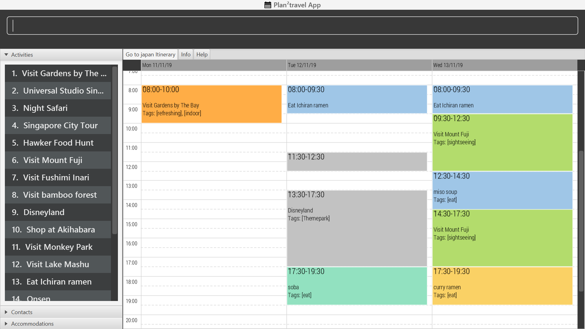

= Oscar Su Zhen Hong - Project Portfolio
:site-section: AboutUs
:imagesDir: ../images
:stylesDir: ../stylesheets

== PROJECT: Plan²travel

*_Plan²travel_* Github link: https://ay1920s1-cs2103t-t09-1.github.io/main/

---

== Overview

*_Plan²travel_* is a desktop travel planning application for student who are planning for an overseas trip.
It has a GUI created with JavaFX and user would interacts with it through a CLI (Command Line Interface). The application is written in Java.
*_Plan²travel_* allows students to better organise their trip information by providing them with a template with these three main list: accommodation, contact and activity list.
Also, *_Plan²travel_* is able to generate a best suited schedule based on the student's requirement and optimise their budget spending for a trip.

Below is a screenshot of our application:

== Summary of contributions

* *Major enhancement*: added *the ability to generate a suitable schedule based on user's requirement*
** What it does: Generate a schedule for specified day(s) based on the type of activities users want for those day(s). Activities scheduled for those day(s) depends on the level on importance they indicated for each activity and whether it has been scheduled.
** Justification: This feature improves the product significantly because it is able to generate a schedule that are non-overlapping and is to the best interest of the user.
** Highlights:
. Current implementation of using Hashmap to store prefix and their arguments does not maintain the order of the prefixes that are being added. As the new enhancement require information of the order of activities to schedule as specified by the user, I have to implement a new way to store those prefixes to maintain their insertion order.
. This enhancement can easily be extended to schedule multiple activities at one time.
. There were many cases to consider to ensure that there were no overlap of activities and we have to still provide a schedule that best suit the requirement of the user.

* *Minor enhancement*: added *the ability to schedule an activity to a day*.
** What it does: Schedule the specified activity from the activity list to the specified day.
** Justification:
*_Plan²travel_* is designed for students to organise their trip information and plan their itinerary.
Therefore, this command is crucial in allowing user to input activity into a particular day so that they can plan their itinerary.
** Highlights:
. This enhancement requires an understanding of how the activity list and the days list are stored and I would need to understand how the parser works so that I could retrieve the relevant information and schedule the activity for specified day.

* *Minor enhancement*: added the model for *Activity*.
** What it does: Forms the backbone of most commands which require activity.
** Justification: Our application is designed for students to plan their activities, and therefore this enhancement is crucial as it would later be involved in most of any other enhancements that take place in future.
** Highlights:
. This enhancement requires an understanding of how a typical activity should consist of so that it does not violate the law of demeter.

* *Other contributions*:
** Enhancement to existing features:
*** Wrote tests for existing feature to improve coverage https://github.com/AY1920S1-CS2103T-T09-1/main/pull/106[#106] https://github.com/AY1920S1-CS2103T-T09-1/main/pull/216[#216]
** Documentation:
*** Contributed to the User Guide and Developer Guide for this project. See below for more details.
** Community:
*** Over 20 https://github.com/AY1920S1-CS2103T-T09-1/main/pulls?utf8=%E2%9C%93&q=is%3Apr+author%3Aoscarsu97[Pull Requests] on Github
*** Over 20 https://github.com/AY1920S1-CS2103T-T09-1/main/pulls?utf8=%E2%9C%93&q=is%3Apr+commenter%3AOneArmyj[Reviews] on Github
*** Overview of Code Contribution https://nus-cs2103-ay1920s1.github.io/tp-dashboard/#=undefined&search=oscarsu97[here]

== Contributions to the User Guide

|===
|_Given below are sections I contributed to the User Guide. They showcase my ability to write documentation targeting end-users._
|===

include::../DeveloperGuide.adoc[tag=scheduleactivity]

=== Scheduling an activity to a day: `schedule`

Schedules an activity to a day +
Format: `schedule ACTIVITY_INDEX st/START_TIME d/DAY_INDEX`

* The indices provided refers to the index of an activity in the activity list and the index of a day in the itinerary.
* The indices provided must be positive integers.
* The indices provided must not exceed the number of activities in the activity list or the number of days in the itinerary.
* The start time should follow a 24-HOUR format (i.e. 1400)

Examples:

* `schedule 2 st/1000 d/2`

Schedules the second activity in the activity list under day 2 at the specified starting time.
=== Auto Schedule: `autoschedule`
Generates a list of activities for the specified days based on the *number of times it
has been scheduled on the timetable.*. Activity with the *least number of time being scheduled on the timetable* will be chosen to be scheduled.
For cases where there is two with the same lowest counts, the one with the higher priority will be chosen.

If the end time of the activity chosen overlaps with the next activity's start time, the
next activity with the next `lowest number of count in the timetable` will be checked. This process will repeat until it finds a suitable activity to schedule or that all the activities that it has checked is deemed unsuitable.

* Timing can be specified if there is an activity that is confirmed to do at that timing.
* An `activity name` can be specified using `n/` instead of `t/` if there is an activity that has been confirmed to do.
* Location for that `day` can be specified, otherwise it is assumed to be any location.
* The `Day` to schedule for can be specified, otherwise it is assumed to be scheduled for all days.

[WARNING]
Ensure that activity with the specified name or tag is present in the activity list first before using the autoschedule command.

[TIP]
You may use `n/` to denote a specific activity name and specify the start time if you have confirmed to do an activity at a specific time.

[TIP]
You may wish to input the location of the activities so that we schedule activities that are in the same location together for the specified day to reduce your travelling time.

Format: `autoschedule (t/TAG [START_TIME]|| n/ACTIVITY_NAME [START_TIME])... [a/LOCATION_OF_ACTIVITIES] [d/DAY_INDEX...]`

Examples:

* `autoschedule t/Breakfast t/Sightseeing t/Dinner`
* `autoschedule t/Breakfast t/Sightseeing t/Dinner a/Kyoto d/1`
* `autoschedule t/Breakfast n/DisneyLand t/Dinner a/Kyoto d/1`
* `autoschedule t/Breakfast 1000 n/DisneyLand t/Dinner a/Kyoto d/1 2 3 4`
== Contributions to the Developer Guide

|===
|_Given below are sections I contributed to the Developer Guide. They showcase my ability to write technical documentation and the technical depth of my contributions to the project._
|===

=== Schedule feature

*_Plan²travel_* allows user to schedule an activity from the activity list to a specified time of a day.
This is accomplished by executing the `ScheduleCommand` with `activity index`, `start time` and  `day index`.

Eg. `schedule ACTIVITY_INDEX st/START_TIME d/DAY_INDEX`

==== Current Implementation

The keywords from the command given by user is parsed using `ScheduleCommandParser` which converts the string variable of start time into a LocalDateTime object, while activity index and day index are converted into Index objects.
These are then passed to the `ScheduleCommand` for execution later on.

Given below is a sequence diagram showing the creation of `ScheduleCommand`:

.Sequence diagram showing how ScheduleCommand is created.
image::ScheduleCommandCreation.png[]

After the creation of `ScheduleCommand`, `LogicManager` will proceed to call the `execute()` method of `ScheduleCommand`.

Below are the steps taken during the execution of `ScheduleCommand`:

1. `Model` will retrieve the list of days from the `Itinerary` and the list of activities from  `UniqueActivityList`.

2. The `activityIndex` and `dayIndex` will then be used to obtain the targeted `Activity` from activity list
and targeted `Day` from list of days.

3. `Activity` will be converted to `ActivityWithTime` using the startDateTime and duration of activity.

4. This `ActivityWithTime` is then added to the list of `ActivityWithTime` in the target `Day`.

5. The list of `ActivityWithTime` is sorted according ActivityWithTime startDateTime.

Given below is a sequence diagram showing the execution of `ScheduleCommand`:

.Sequence diagram showing how ScheduleCommand executes.
image::ScheduleCommandExecution.png[]

==== Design Consideration

===== Aspect: Update activities for that particular day

* **Current Choice:** Directly updates the activity list in the targeted `Day` class.
** Pros: Seem more intuitive and simple to implement.
** Cons: Might make it harder to debug error that surface if many other functions/classes also depends on the same `Day` class.
* **Alternative:** Create a new `Day` class with the new updated activity list to replace the targeted `Day` class.
** Pros: Easier for developer to test the code.
** Cons: Might create unnecessary overheads in the code by creating new object every time we schedule an activity.

=== Auto Schedule feature
==== Rationale
There are times when users are planning for an overseas trip, there are so many activities in their activity list that they want to do but the problems faced are that they are unable to finish all the activities in the list or they are unable to find an optimal schedule plan.

==== Overview
The `autoschedule` command requires user to specify either the `tag name` or the `activity name` itself in order of the type of activity that they want.
For example, `t/shopping t/sightseeing t/dining` would means an activity of `shopping` type would be scheduled first followed by `sightseeing` and then `dining`.
Before using the autoschedule command, users are to fill up their activity list first and ensure that they have input the `duration` for each activity and are recommended to input their `priority` for those activities.
Afterwards, `autoschedule` would serve to ensure that the activities scheduled do not overlap, are according to what the users prioritised first and that all activities have a chance to be scheduled.

=== Implementation
The keywords from the command given by the user is parsed using `AutoScheduleCommandParser` which converts all the `tag` or `name` prefix's argument with their respective `start time` ,if given, in `NameOrTagWithTime` class and stores them in a list to maintain the same ordering as given by the user.
If `address` is specified, it is wrapped in an `Address` class and if the `day index(es)` to schedule are specified, they stored in a list with each index wrapped in an `Index` class.
The `list of NameOrTagWithTime`, `address` and `list of day indexes` are then passed to the `AutoScheduleCommand` for execution later on.

Given below is a sequence diagram showing the creation of `AutoScheduleCommand`:

.Sequence diagram showing how `AutoScheduleCommand` is created.
image::AutoScheduleSequenceDiagram.png[]

Below are the steps taken when executing of the `AutoScheduleCommand`:

*Step 1.* `AutoScheduleCommand` will firstly get the `list of days` and `list of activities` from the `Model` class

*Step 2.* If address is specified, the `list of activities` will be filtered to get all activities that has the same `address`.

*Step 3.* If no `day indexes` to schedule are being specified, `AutoScheduleCommand` will generate a schedule for all `days`.

Below shows the checks taken by `AutoScheduleCommand`:

.Activity diagram showing how `AutoScheduleCommand` checks the requirement given by user:
image::AutoScheduleActivityDiagram1.png[]

After filtering the activity list, `AutoScheduleCommand` will proceed to begin preparation for the scheduling of the first activity of those specified day(s).

*Step 4.* It will filter the activity list that has been filtered by address to get all the activities with the same tag or activity name as the first activity to schedule.

*Step 5.* After which it will sort the list such that the activity that has not been scheduled will be scheduled first.It will ensure that for cases where both activities has not been scheduled before, the one with the higher priority will be scheduled first.

.Activity diagram showing how `AutoScheduleCommand` handles the preparation for the scheduling of the first activity:
image::AutoscheduleActivityDiagram2.png[]

*Step 6.* Next, `AutoScheduleCommand` will check if the chosen activity to be scheduled does not overlap with the start time of the next activity if user specify.

*Step 7.* If the chosen activity overlaps, it will traverse the filtered list, picking the next activity with the **next lowest count** in the itinerary and check if it overlaps.
The process will continue until it finds a suitable activity or it has finished traversing the whole filtered list. If it is planning for the last activity of the day, it will instead check whether the activity chosen overlap til the next day.

.Activity diagram showing how `AutoScheduleCommand` finds an activity to schedule:
image::AutoScheduleActivityDiagram3.png[]

Step 4 to Step 7 will repeat for the next activity to schedule for that day until it finished scheduling for that day or it could not find a suitable activity to schedule.
If there other days to schedule, the steps taken will also be the same as Step 4 to Step 7.

==== Design Considerations

===== Aspect: Counting the number of times similar activity of the same name or tag appears in the list
* **Current Choice:** Count the number of times all the similar activities appear in the itinerary every time we are planning to schedule an activity.
** Pros: It will ensure that the count number for the similar activities will always be right before they are chosen to be scheduled
** Cons: Slow down the program as we have to traverse through all the activities for each day everytime we are planning to schedule for an activity.
* **Alternative:** Have a counter inside the activity itself to keep track
** Pros: Significantly improve the runtime speed and less complicated to implement
** Cons: Over time, the count might be inaccurate due to multiple scheduling and unscheduling which alter the count number and we might not have keep track of it at certain point of time.

===== Aspect: Account for travelling time
* **Current Choice:** Allows user to input the start time of activity
** Pros: Gives user the flexibility and they are better able to gauge the travelling time of each activity
** Cons: It restrict the number of possible activities that could be scheduled as we have to consider activity not overlapping with the start time of the next activty.
* **Alternative:** Fix a break of 30min between every activity to acount for travel time
** Pros: Activities that user prioritised are more likely to be scheduled as we do not have to consider overlap of the start time of next activity.
** Cons: Certain activity may require more travelling time. If we fix a longer travelling time, it might not be optimising the schedule plan as certain activity might have shorter travelling time.