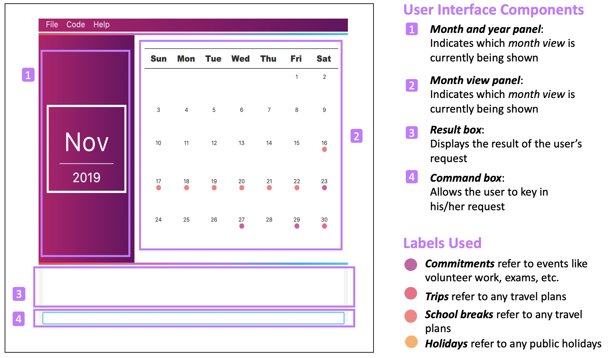
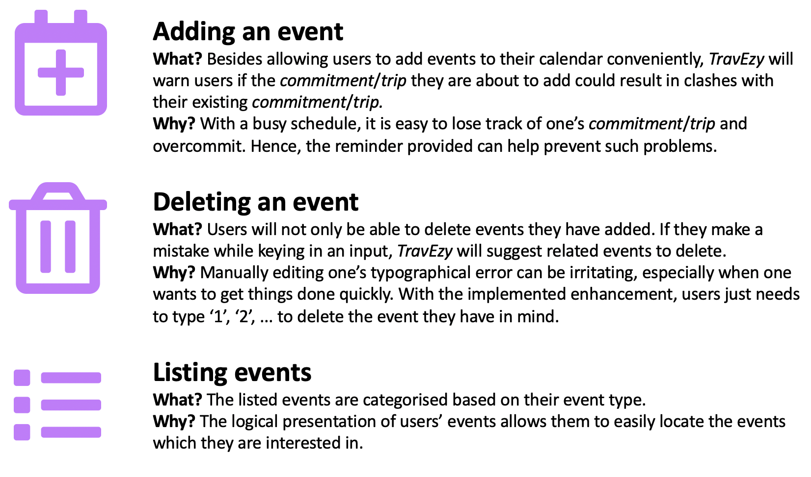

= Poh Lin Wei's Project Portfolio 

This portfolio highlights my contributions to the development of _TravEzy_, an all-in-one application which helps student 
travellers to easily plan their trips, manage their expenses and record their favourite moments.

= Introduction

This section explains how _TravEzy_ came to life and highlights the main features that it offers.

== About the Project _TravEzy_

_TravEzy_ is an application developed by my team of five during our software engineering module (CS2103T), 
and is morphed from  https://github.com/nus-cs2103-AY1920S1/addressbook-level3[this address book application]. 

.To fulfil the requirements of the module, we had to ensure that _TravEzy_ ...
- uses https://www.defit.org/?s=desktop+application[command line interface (CLI)] as the primary mode of input 
(this means that users of the application should be able to use most functionalities by typing in commands)
- is a https://www.pcmag.com/encyclopedia/term/41158/desktop-application[desktop application] (this implies 
that users should be able to use this application on their computers, even without a web browser)

We chose to develop _TravEzy_ because we discovered that several avid student travellers at our university 
(National University of Singapore) would love to have an application that brings together the functionalities 
of their favourite travel-related applications. This would give them easy access to the features that they enjoy most.

So how did my team and I achieve the above goal with _TravEzy_?

== _TravEzy_'s Main Features

_TravEzy_ brings together essential features of popular travel-related applications: it is a one-stop solution 
that makes it easier for travellers to *plan their trips*, *manage their expenses* and *record their memorable moments*. 

The main features of our application are the *calendar*, *itinerary*, *address book*, *financial tracker* and *diary*.

= Reading This Document

This section describes the symbols and formats that are used in this document.

.Symbols and fonts
[grid="rows", frame="none"]
|===
| Font and Format | What it indicates

| _italics_
| Italicised text indicates that the text has a definition that is specific to the application. Its definition will be provided along the way.

| ``command``
| A grey highlight means that the user can use the given text to perform certain actions (e.g. adding an event to the calendar).

| https://github.com/AY1920S1-CS2103T-T17-2/main/blob/master/docs/DeveloperGuide.adoc[``Class``]
| A grey highlight with blue text implies that the word refers to a component, class or object in the diagram shown.

|===

= Summary of Contributions

This section provides an overview of my contributions to this project. As I was primarily responsible for implementing the calendar feature, this section will mainly focus on my contributions to this feature.

== Major Highlights of the Calendar

=== Design

To enable users to better visualise their schedule for the month and plan their trips accordingly, I designed the calendar user interface as follows:

.Calendar interface

{empty}

Whenever users add a new type of event (a _commitment_, _trip_, _school break_ or _holiday_) to a particular day, it will be reflected on the calendar as a new _label_. These _labels_ are also colour coded (as shown in figure 2) so that users can easily identify the types of event they have for the day.

=== Suggestion Functionality 

Finding a suitable time to travel can be especially difficult for NUS (National University of Singapore) students who have a packed schedule. Thus, I decided to implement a suggestion functionality that recommends the users suitable periods to travel. This is done by comparing their _school break_ and _holiday_ schedule with their _commitments_ and _trips_ schedule.

With this feature, users no longer have to manually look for free blocks. Instead, they just need to use the command ``suggest``.

=== Check Availability Functionality

Determining whether it is possible to travel at a specific period of time can be a hassle for users. Hence, I chose to implement a check availability functionality that makes this task simpler. 

Instead of having to switch to the relevant month view to determine their availability, users simply need to use the command ``check``. This can be especially helpful when users are interested in multiple trips but are unsure of whether they will be available to go for them. 

== Other Highlights

In addition to the above, I enhanced a few basic functionalities as follows:

.Summary of enhancements 

{empty}

To view my code in more detail, please click https://nus-cs2103-ay1920s1.github.io/tp-dashboard/#sort=totalCommits%20dsc&groupSelect=groupByAuthors&search=&sortWithin=title&since=2019-09-06&until=2019-10-13&timeframe=commit&mergegroup=false&breakdown=false&tabOpen=true&tabType=authorship&tabAuthor=pohlinwei&tabRepo=AY1920S1-CS2103T-T17-2%2Fmain%5Bmaster%5D[here].

== Other contributions

.In addition to the above, I also...
-	implemented the common command ``goto``. This enables the user to easily navigate from one feature to another without having to open multiple windows. (Pull requests https://github.com/AY1920S1-CS2103T-T17-2/main/pull/32[#32], https://github.com/AY1920S1-CS2103T-T17-2/main/pull/37[#37])
-	reviewed pull request and provided suggestions for improvements (Pull request https://github.com/AY1920S1-CS2103T-T17-2/main/pull/39[#39], https://github.com/AY1920S1-CS2103T-T17-2/main/pull/180[#180])
-	managed the release of TravEzy version 1.1 and 1.2 
-	made the user guide more reader-friendly (Pull requests https://github.com/AY1920S1-CS2103T-T17-2/main/pull/104[#104], https://github.com/AY1920S1-CS2103T-T17-2/main/pull/108[#108], https://github.com/AY1920S1-CS2103T-T17-2/main/pull/193[#193])

= Contributions to User Guide 

|===
|_Given below are sections I contributed to the User Guide. They showcase my ability to write documentation targeting end-users._
|===

include::../UserGuide.adoc[]

include::../UserGuide.adoc[]

= Contributions to the Developer Guide

|===
|_Given below are sections I contributed to the Developer Guide. They showcase my ability to write technical documentation and the technical depth of my contributions to the project._
|===

include::../DeveloperGuide.adoc[]

include::../DeveloperGuide.adoc[]

