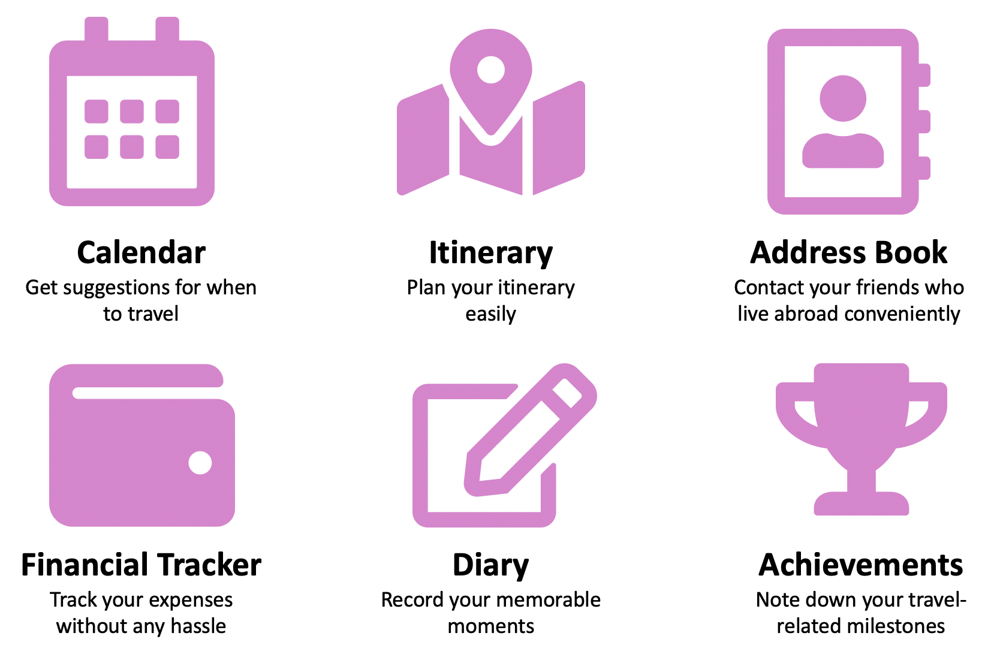

= Poh Lin Wei's Project Portfolio 

This portfolio highlights my contributions to the development of _TravEzy_, an all-in-one application which helps student 
travellers to easily plan their trips, manage their expenses and record their favourite moments.

= Introduction

This section explains how _TravEzy_ came to life and highlights the main features that it offers.

== About the Project _TravEzy_

_TravEzy_ is an application developed by my team of five during our software engineering module (CS2103T), 
and is morphed from this address book application [link here]. 

.To fulfil the requirements for the module, we had to ensure that TravEzy ...
- uses https://www.defit.org/?s=desktop+application[command line interface (CLI)] as the primary mode of input 
(this means that users of the application should be able to use most functionalities by typing in commands)
- is a https://www.pcmag.com/encyclopedia/term/41158/desktop-application[desktop application] (this implies 
that users should be able to use this application on their computers, even without a web browser)

We chose to develop _TravEzy_ because we discovered that several avid student travellers at our university 
(National University of Singapore) would love to have an application that brings together the functionalities 
of their favourite travel-related applications. This would give them easy access to the features that they enjoy most.

So how did my team and I achieve the above goal with _TravEzy_?

= TravEzy's Main Features

_TravEzy_ brings together essential features of popular travel-related applications: it is a one-stop solution 
that makes it easier for travellers to *plan their trips*, *manage their expenses* and *record their memorable moments*. 

These are the main features of our application:

.Main features of TravEzy

