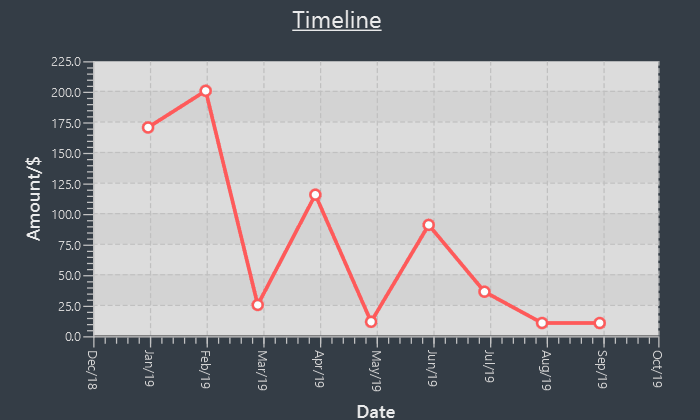

= Huang Weijie - _Billboard Project Portfolio Page_
:site-section: AboutUs
:imagesDir: ../images
:stylesDir: ../stylesheets

== Project: <Billboard>

== Purpose
The purpose of this page is to consolidate the various contributions that I have made in the process of working on this software engineering project and building Billboard,
from code and documentation to team tasks and project management.

== Overview
For CS2103T, a Software Engineering module, my team of 4 others and I were tasked with enhancing a pre-existing application called AddressBook 3.
It was a desktop Address Book application of considerable size. Through the various cycles of ideation and development, we eventually settled on the idea for Billboard.

Billboard is a financial management application with emphasis on speed and simplicity. Among the unique traits of Billboard is that
it is a desktop Command Line Interface (CLI) application, with most of its functionality accessed via typing commands into a console. Billboard supports all the basic operations
that are needed to effective manage your finances. You can:

* Add new expenses to the list
* Edit past expenses
* Delete past expenses
* View your expenses so you are able to keep track of them

Additionally, Billboard sports several enhanced features that make it stand out. These features include tagging expenses,
archiving past expenses, filtering the current list of expenses, and dynamically displaying statistics based on the current expense.
All these features aim to ease the process of managing and organizing your finances.

== Legend
The below styles of formatting are used to demarcate certain sections of text with special meaning:

NOTE: Additional information that the reader should take note of.

`text`: Indicates that text should be treated as a command or code.

== Summary of contributions
=== Preface
This section documents the various contributions I have made to Billboard, in the hopes that it will serve as a useful reference and proof of work in the future.
These contributions include code, documentation, as well as project management.

* *Code contributed*: [https://nus-cs2103-ay1920s1.github.io/tp-dashboard/#search=weiijiie[Functional code tracked by RepoSense]][https://github.com/AY1920S1-CS2103T-F12-4/main[GitHub Repository for project]]

* *Major Feature*: Completely implemented statistics chart feature from the ground up

** Details: Feature is a fully responsive statistic display feature. Statistics based on the currently shown expenses are displayed in a statistics panel.
Any changes to the expenses will automatically trigger an update in the displayed statistics. In addition, various types of charts with various ways to add extra configuration are bundled with the feature.

** Justification: This feature is a significant and noticeable enhancement to the user experience. One of the critical areas of managing finances is being able
to keep track of and monitor your expenses over time. My statistics feature offers several different ways for users to do that. In addition, its dynamically updating
capabilities means less keystrokes wasted for the user to configure the statistics to see what he wants, greatly improving speed of use.

** Highlights:
*** This feature integrates well with, and even complements existing features. Combined with the tagging feature, it allows users to easily group expenses by tags to
view, allowing for a high degree of organization. Combined with the finding functionality, it allows users to be able to effectively search for expenses they want, and instantly get an overview of relevant information.
*** An attempt was made to make the implementation as extensible as possible. For example, adding different types of charts and different options to configure the charts should not be a huge issue.
However, certain other changes such as adding new types of financial records (ie. income) may pose some difficulty to adapt.
*** Credits: JavaFX Chart library, for providing robust, configurable charts GUI implementations.

{nbsp} +

** *Minor enhancements*:
*** Updated Ui to a format that can integrate the statistics chart in an eye-pleasing manner.
*** Wrote reusable and generic classes and methods that team members incorporated into their code. [https://github.com/AY1920S1-CS2103T-F12-4/main/blob/master/src/main/java/seedu/billboard/commons/core/date/DateInterval.java[DateRange Enum]]

{nbsp} +

** *Other contributions*:

** Project management:
*** Set up Git Repository with branch protection rules and configured CICD to work with new repository.
*** Set up project issue board on GitHub and created various labels to ease issue management and create a single source of truth for project development.

** Enhancements to existing features:
*** Did initial adapting of `Person` in AddressBook to `Expense` in Billboard. [https://github.com/AY1920S1-CS2103T-F12-4/main/pull/38[PR #38]]
*** Extensively wrote tests to help maintain a code coverage of above 75%.

** Documentation:
*** Did the initial adaptation of the user guide from AddressBook to a Billboard specific one. [https://github.com/AY1920S1-CS2103T-F12-4/main/pull/18[PR #18]]
*** Replaced almost all of the instances of the word "AddressBook" and "Person" from the project JavaDocs and replaced them with "Billboard" and "Expense."[https://github.com/AY1920S1-CS2103T-F12-4/main/pull/38[PR #38]]

** Community:
*** PRs reviewed (with non-trivial review comments): https://github.com[#12], https://github.com[#32], https://github.com[#19], https://github.com[#42]
*** Contributed to forum discussions (examples:  https://github.com[1], https://github.com[2], https://github.com[3], https://github.com[4])
*** Reported bugs and suggestions for other teams in the class (examples:  https://github.com[1], https://github.com[2], https://github.com[3])
*** Some parts of the history feature I added was adopted by several other class mates (https://github.com[1], https://github.com[2])

** Tools:
*** Added third party libraries (HamCrest and Mockito) to the project to help to ease writing fluent and effective unit tests.
*** Updated Checkstyle rules to fit our teams requirements.

== Contributions to the User Guide

|===
|_Given below are sections I contributed to the User Guide. They showcase my ability to write documentation targeting end-users._
|===

include::../UserGuide.adoc[tag=statistics]

== Contributions to the Developer Guide

|===
|_Given below are sections I contributed to the Developer Guide. They showcase my ability to write technical documentation and the technical depth of my contributions to the project._
|===

include::../DeveloperGuide.adoc[tag=statistics]

== PROJECT: PowerPointLabs

---

_{Optionally, you may include other projects in your portfolio.}_